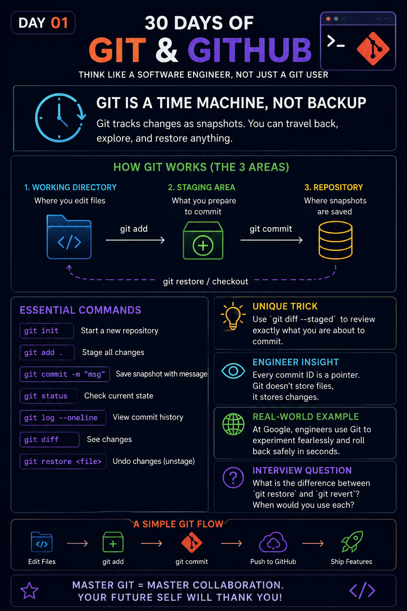

# 🚀 Day 01 — Git is a Time Machine, Not Backup

> **30 Days of Git & GitHub**
>
> Learn Git the way professional software engineers use it.

---

<p align="center">
  
</p>

---

# 📖 Today's Goal

Most developers think Git is simply a backup tool.

It isn't.

Git is a **Version Control System** that records your project's history as a series of snapshots.

Instead of asking:

> *"Where is my backup?"*

Git lets you ask:

> *"Show me exactly how my project looked yesterday, last week, or six months ago."*

That's why engineers call Git a **time machine**.

---

# 🧠 Understanding the Diagram

The infographic shows Git's complete workflow.

```
Working Directory
       │
   git add
       ▼
 Staging Area
       │
 git commit
       ▼
 Repository
```

### 📝 1. Working Directory

This is where you write code.

Example:

```
index.html
app.js
style.css
```

Nothing is saved into Git yet.

---

### 📦 2. Staging Area

Think of this as a **preview area**.

You choose exactly what should become part of the next commit.

```bash
git add app.js
```

Only that file is staged.

---

### 💾 3. Repository

After running

```bash
git commit -m "Add login validation"
```

Git stores a snapshot forever.

Every commit becomes part of your project's history.

---

# ⚡ Essential Commands Explained

| Command | Purpose |
|----------|----------|
| `git init` | Create a new Git repository |
| `git status` | Check repository status |
| `git add .` | Stage all changes |
| `git commit -m "message"` | Save a snapshot |
| `git log --oneline` | View commit history |
| `git diff` | Compare file changes |
| `git restore file` | Restore a file |

---

# 💡 Unique Trick

Before committing, always run:

```bash
git diff --staged
```

This lets you verify exactly what will be committed.

Many production mistakes can be avoided with this one command.

---

# 👨‍💻 Engineer Insight

Git doesn't repeatedly store every file.

Instead, it stores relationships between snapshots.

That's why Git remains extremely fast even for repositories with thousands of commits.

---

# 🌍 Real-World Example

Imagine you're developing an e-commerce website.

You implement a payment gateway.

A bug appears after deployment.

Instead of manually fixing dozens of files,

Git lets you instantly return to the last stable version.

That's why every professional engineering team relies on Git.

---

# ❓ Interview Question

**What is the difference between these commands?**

- `git restore`
- `git reset`
- `git revert`

When should each one be used?

Try answering before checking the documentation.

---

# 🔄 Complete Git Workflow

```
Edit Files
     │
     ▼
git add
     │
     ▼
git commit
     │
     ▼
git push
     │
     ▼
GitHub
```

---

# 🎯 Key Takeaways

- ✅ Git is Version Control, not cloud storage.
- ✅ Every commit is a snapshot.
- ✅ Stage only what you want to commit.
- ✅ Always review changes before committing.
- ✅ Small, meaningful commits make collaboration easier.

---

## 📅 Series Progress

| Day | Topic | Status |
|------|-------|--------|
| ✅ Day 01 | Git is a Time Machine, Not Backup | Completed |
| ⏳ Day 02 | Git Objects (Blob, Tree, Commit & Tag) | Coming Next |

---

## ⭐ Enjoyed this lesson?

If this helped you learn something new:

- ⭐ Star the repository
- 🍴 Fork it
- 📢 Share it with other developers

**One commit a day. One step closer to mastering Git. 🚀**

#30DaysOfGit #Git #GitHub #SoftwareEngineering