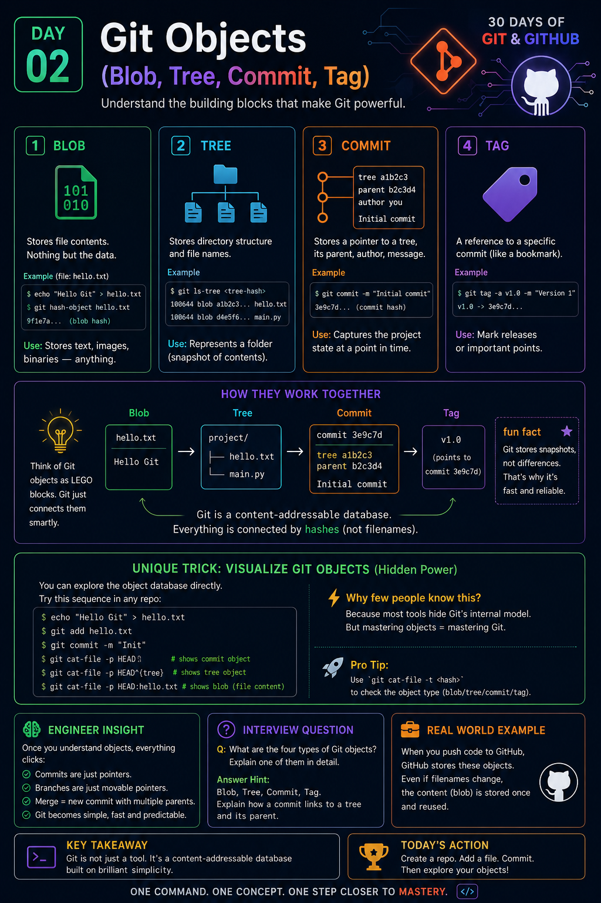

# Day 02 — Git Objects (Blob, Tree, Commit, Tag)

> **30 Days of Git & GitHub**
>
> Think Like a Software Engineer, Not Just a Git User.

---

## 📌 Infographic

<p align="center">
  
</p>

> 💡 **Today's Goal:** Understand the four Git object types that form the foundation of every Git repository.

---

# 📖 Introduction

Every Git repository is built on just **four object types**:

- Blob
- Tree
- Commit
- Tag

Most developers use Git commands every day without knowing how Git stores information internally. Once you understand these objects, Git becomes much easier to reason about, debug, and use confidently.

---

# 🟢 1. Blob

## What is a Blob?

A **Blob (Binary Large Object)** stores the contents of a file.

It **does not** store:

- filename
- folder
- permissions

It stores only the actual data inside the file.

### Example

```text
hello.txt

Hello Git
```

Git creates

```text
Blob

↓

Hello Git
```

If two files contain identical content, Git stores only **one Blob** and both files reference it.

### Why it matters

- Saves storage space
- Prevents duplicate content
- Makes Git efficient

---

# 🔵 2. Tree

## What is a Tree?

A Tree represents a directory.

It stores:

- filenames
- folder names
- file permissions
- references to Blob objects
- references to other Tree objects

Example

```text
project/

├── main.py
├── app.py
└── README.md
```

Internally

```text
Tree

├── Blob(main.py)

├── Blob(app.py)

└── Blob(README.md)
```

Think of a Tree as the **table of contents** of a folder.

---

# 🟠 3. Commit

A Commit stores a snapshot of your project.

A commit contains

- Tree hash
- Parent commit
- Author
- Committer
- Date
- Commit message

Example

```bash
git commit -m "Initial Commit"
```

Git creates

```text
Commit

↓

Tree

↓

Parent Commit

↓

Author

↓

Timestamp

↓

Message
```

A commit **does not store files directly**.

Instead, it points to a Tree object.

---

# 🟣 4. Tag

Tags are human-friendly names for commits.

Instead of remembering

```
e6ab89c1...
```

you can simply use

```
v1.0
```

Example

```bash
git tag -a v1.0 -m "First Release"
```

Tags are commonly used for

- Releases
- Production versions
- Milestones

---

# 🔄 How They Work Together

Everything in Git connects together.

```text
Tag
 │
 ▼
Commit
 │
 ▼
Tree
 │
 ▼
Blob
```

A Commit points to a Tree.

The Tree points to many Blobs.

Each Blob stores the actual content.

---

# 💡 Understanding the Infographic

The infographic illustrates the complete relationship between Git objects.

### Blob

- Stores only file content.
- Does not know filenames.

---

### Tree

- Organizes files into folders.
- References Blobs.

---

### Commit

- Represents one project snapshot.
- Links to its parent commit.

---

### Tag

- Gives an easy-to-remember name to a specific commit.

---

# 🚀 Unique Engineer Insight

Think of Git like LEGO.

Instead of copying an entire project every time you commit, Git simply connects existing objects together.

If only one file changes:

- unchanged Blobs are reused
- unchanged Trees are reused where possible
- only new objects are created

This design is one of the reasons Git is incredibly fast and storage-efficient.

---

# ⚡ Pro Tip

Explore Git's object database yourself.

```bash
git cat-file -p HEAD
```

View the current Tree

```bash
git cat-file -p HEAD^{tree}
```

View a Blob

```bash
git cat-file -p <blob_hash>
```

Inspect object type

```bash
git cat-file -t <hash>
```

These commands help you understand what Git stores behind the scenes.

---

# 🌍 Real World Example

Suppose your repository contains:

```
README.md
main.py
config.json
```

You edit only `README.md`.

Git creates:

- New Blob (README)
- New Tree
- New Commit

Git **does not recreate** the unchanged Blobs for `main.py` and `config.json`.

This reuse is why Git repositories remain compact even after thousands of commits.

---

# 🎯 Interview Question

### Question

What are the four Git object types, and how are they related?

### Expected Answer

- Blob stores file contents.
- Tree stores directory structure.
- Commit stores project snapshots.
- Tag provides a readable reference to a commit.

Relationship:

```text
Tag
↓

Commit
↓

Tree
↓

Blob
```

---

# 📚 Key Takeaways

✅ Git is a content-addressable database.

✅ Blob stores file contents.

✅ Tree stores folder structure.

✅ Commit stores snapshots.

✅ Tag names important commits.

✅ Everything inside Git ultimately points to Blobs.

---

# 📝 Try It Yourself

Create a repository.

```bash
mkdir git-demo
cd git-demo
git init
```

Create a file.

```bash
echo "Hello Git" > hello.txt
```

Create a Blob.

```bash
git hash-object -w hello.txt
```

Create a Commit.

```bash
git add .
git commit -m "Initial Commit"
```

Inspect the objects.

```bash
git cat-file -p HEAD
git cat-file -p HEAD^{tree}
git ls-tree HEAD
```

Observe how Git stores your project internally.

---

# 🎉 Congratulations!

You now understand the **four fundamental Git object types** that power every Git repository.

Understanding these internals will make advanced Git concepts—such as rebasing, merging, cherry-picking, and recovering history—much easier to learn.

---

## ⏭️ Next Day

➡️ **Day 03 — Why Git Uses SHA Hashes**