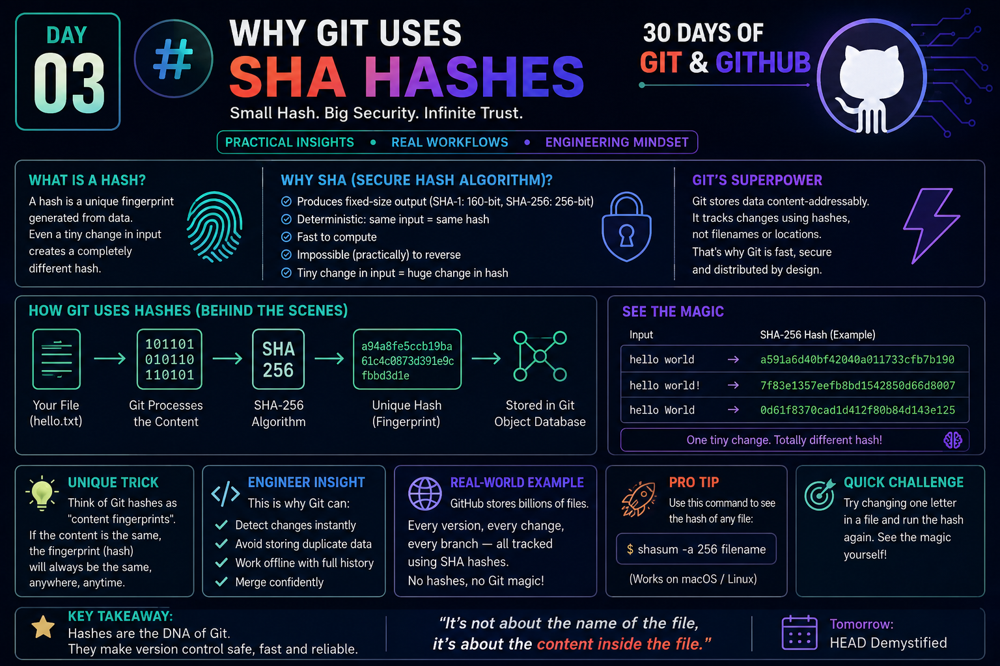

# Day 03 — Why Git Uses SHA Hashes

> **30 Days of Git & GitHub**
>
> Think Like a Software Engineer, Not Just a Git User.


<p align="center">
  
</p>

> Repository Structure

```text
30-Days-of-Git-GitHub/
│
├── images/
│   └── day03-why-git-uses-sha-hashes.png
│
└── Day-03/
    └── README.md
```

---

# Day Objective

After completing this lesson, you will understand:

- Why Git uses SHA hashes
- What a hash actually is
- Why Git identifies content instead of filenames
- Why changing even one character changes the hash completely
- How hashes make Git reliable and distributed
- How Git internally stores objects

---

# What is a Hash?

A **hash** is a mathematical fingerprint of data.

It converts any input into a fixed-length string.

Example:

```
hello
↓

2cf24dba5fb0...
```

Even a tiny modification changes the fingerprint completely.

```
hello
↓

2cf24dba...

hello!

↓

ce06092f...
```

This property is called the **Avalanche Effect**.

---

# Why Doesn't Git Use File Names?

Git doesn't care about filenames.

Git cares about **content**.

Example

```
resume.pdf
```

Rename it

```
my_resume.pdf
```

Content is identical.

Git sees:

```
Same Content
↓

Same Hash
```

Nothing new needs to be stored.

---

# Git Stores Content, Not Files

Internally Git works like this:

```
Your File
     │
     ▼
Read Content
     │
     ▼
Generate SHA Hash
     │
     ▼
Store Object
```

Everything inside Git becomes an object.

Examples

- Blob
- Tree
- Commit
- Tag

Every object receives its own SHA hash.

---

# Why SHA?

SHA stands for

**Secure Hash Algorithm**

Git originally used

```
SHA-1
```

Modern Git also supports

```
SHA-256
```

Properties:

- Deterministic
- Fast
- Fixed length
- Extremely low collision probability
- Impossible (practically) to reverse

---

# Avalanche Effect

Small input change

```
Hello
```

↓

```
a591a6...
```

Now change only one letter

```
hello
```

↓

```
2cf24d...
```

Almost every character changes.

That is why Git instantly detects modifications.

---

# Git's Superpower

Git stores data **content-addressably**.

Instead of

```
Documents/file.txt
```

Git thinks

```
Object

↓

SHA Hash

↓

Database
```

This is why

- Git is fast
- Git is reliable
- Git avoids duplicate storage
- Git verifies integrity automatically

---

# Git Object Database

Every Git object is stored inside

```
.git/objects/
```

Example

```
.git/
    objects/
```

Inside you'll see folders like

```
ab/

9f/

4d/
```

The first two characters of the SHA become the folder name.

The remaining characters become the file name.

---

# Engineering Insight

Git is **not** a file tracker.

Git is a **content tracker**.

That one design decision explains almost everything about Git.

---

# Why Git Is So Fast

Imagine two files

```
Report.docx
```

and

```
Copy.docx
```

Both contain identical data.

Git generates

```
Same SHA
```

Instead of storing both,

Git stores

```
One Object

↓

Two references
```

Less storage.

More speed.

---

# Real World Example

GitHub hosts billions of Git objects.

Without SHA hashes,

GitHub would have

- huge duplication
- slower cloning
- larger repositories

Hashes make Git scalable.

---

# Practical Demo

Create a file

```
hello.txt
```

Generate its SHA

### macOS / Linux

```bash
shasum -a 256 hello.txt
```

### Git (Blob Hash)

```bash
git hash-object hello.txt
```

Modify one character.

Run again.

Observe

```
Completely Different Hash
```

---

# Unique Trick

Think of hashes like fingerprints.

```
Person
↓

Fingerprint

Unique
```

Similarly

```
File
↓

SHA Hash

Unique
```

Git identifies files exactly like fingerprints identify people.

---

# Common Misconception

❌ Git tracks filenames.

Correct:

✅ Git tracks file content.

The filename is only metadata.

The content generates the identity.

---

# Interview Question

### Why does Git use SHA hashes instead of filenames?

### Answer

Git identifies content rather than filenames.

This enables:

- Integrity verification
- Duplicate elimination
- Fast comparisons
- Distributed synchronization
- Reliable version history

---

# Quick Challenge

Run:

```bash
git hash-object hello.txt
```

Now add one character.

Run it again.

Observe how the hash changes completely.

---

# Key Takeaways

- Git identifies content using SHA hashes.
- Every object has a unique fingerprint.
- Even a one-character change produces a new hash.
- Hashes enable integrity verification and efficient storage.
- Git is fundamentally a content-addressable database.

---

# Tomorrow

**Day 04 — HEAD Demystified**

You'll finally understand what **HEAD** actually points to and why commands like `checkout`, `switch`, and `reset` behave the way they do.

---

## Connect with Me

If you found this helpful, follow the complete **30 Days of Git & GitHub** series.

**GitHub:** https://github.com/hjibhakate  
**LinkedIn:** https://www.linkedin.com/in/hjibhakate/

**Created by:** **@harshad_jibhakate** 🚀

---

⭐ If this repository helped you learn something new, don't forget to **Star** the repository and share it with fellow developers!