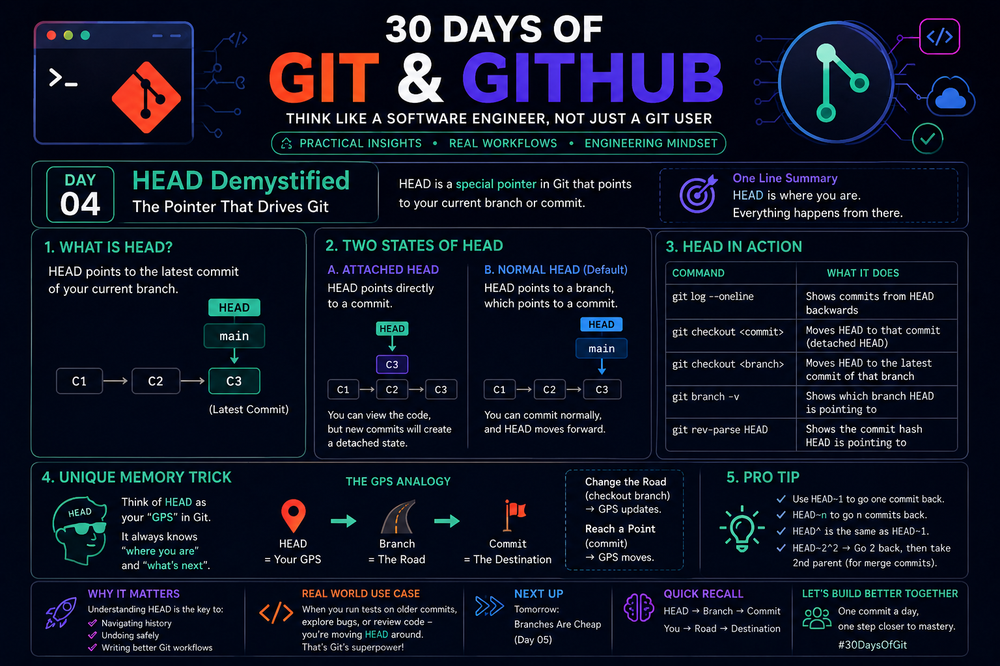

# Day 04 – HEAD Demystified: The Pointer That Drives Git

<p align="center">
  
</p>

## 📌 Overview

**HEAD** is one of the most important concepts in Git. It is a **special reference (pointer)** that tells Git **where you are currently working**. Every commit, checkout, merge, or rebase starts from the location pointed to by **HEAD**.

Think of **HEAD** as your **current position** inside the Git timeline.

> **One-Line Summary:**  
> **HEAD tells Git your current location in the repository.**

---

# 1️⃣ What is HEAD?

HEAD points to the **latest commit** of the currently checked-out branch.

Example:

```text
main
 │
 ▼
C1 ───► C2 ───► C3
              ▲
             HEAD
```

Here:

- Current branch = `main`
- Latest commit = `C3`
- HEAD points to `C3`

Whenever you create a new commit, HEAD automatically moves forward.

---

# 2️⃣ Two States of HEAD

## A. Normal (Attached) HEAD ✅

This is the default state.

HEAD points to a **branch**, and the branch points to the latest commit.

```text
HEAD
 │
 ▼
main
 │
 ▼
C1 → C2 → C3
```

Characteristics:

- Safe working state
- New commits are saved normally
- Branch history continues

---

## B. Detached HEAD ⚠️

A detached HEAD occurs when you checkout a specific commit instead of a branch.

Example:

```bash
git checkout abc123
```

Result:

```text
HEAD
 │
 ▼
C2

main
 │
 ▼
C3
```

Characteristics:

- You can inspect old commits.
- New commits are not attached to any branch.
- Changes can be lost unless you create a new branch.

Create a branch to preserve your work:

```bash
git switch -c feature
```

---

# 3️⃣ HEAD in Action

| Command | Purpose |
|----------|---------|
| `git log --oneline` | View commit history from HEAD backward |
| `git checkout <branch>` | Move HEAD to another branch |
| `git checkout <commit>` | Create a detached HEAD |
| `git branch --show-current` | Show the current branch |
| `git rev-parse HEAD` | Display the commit hash of HEAD |

---

# 4️⃣ Memory Trick – GPS Analogy 🧠

Imagine Git as a road trip.

| Git Concept | Real-Life Analogy |
|-------------|------------------|
| HEAD | GPS Location |
| Branch | Road |
| Commit | Destination |

Whenever you move to another branch or commit, your **GPS (HEAD)** updates automatically.

### Quick Rule

> **HEAD always knows where you are.**

This simple analogy makes HEAD easy to remember during interviews and practical work.

---

# 5️⃣ Pro Tips

### Move one commit back

```bash
HEAD~1
```

Example:

```bash
git show HEAD~1
```

---

### Move multiple commits back

```bash
HEAD~3
```

Shows the commit three steps before HEAD.

---

### Parent notation

```bash
HEAD^
```

Represents the first parent commit.

Useful while working with merge commits.

---

# 🚀 Why Understanding HEAD Matters

Knowing HEAD helps you:

- Navigate commit history confidently
- Undo mistakes safely
- Understand branching
- Perform rebasing correctly
- Resolve merge issues
- Work efficiently in collaborative projects

Most advanced Git operations rely on a clear understanding of HEAD.

---

# 💼 Real-World Example

Suppose you're debugging an old version of your project.

Instead of creating a new branch immediately, you can inspect an old commit:

```bash
git checkout 3f5a8d2
```

Git moves to a **Detached HEAD** state.

After testing, return to your branch:

```bash
git checkout main
```

If you made useful changes while detached:

```bash
git switch -c bug-fix
```

This creates a branch and preserves your work.

---

# 🧠 Quick Recall

Remember this sequence:

```text
HEAD → Branch → Latest Commit
```

Or simply:

> **HEAD = "You are here" in Git.**

---

# 📖 Key Takeaways

- HEAD is Git's current position pointer.
- Normally, HEAD points to a branch.
- A branch points to the latest commit.
- Detached HEAD occurs when checking out a commit directly.
- HEAD moves automatically as you switch branches or create commits.
- Understanding HEAD is essential for advanced Git workflows like rebasing, resetting, cherry-picking, and merging.

---

### 🎯 Next Topic

**Day 05 – Branches Are Cheap**