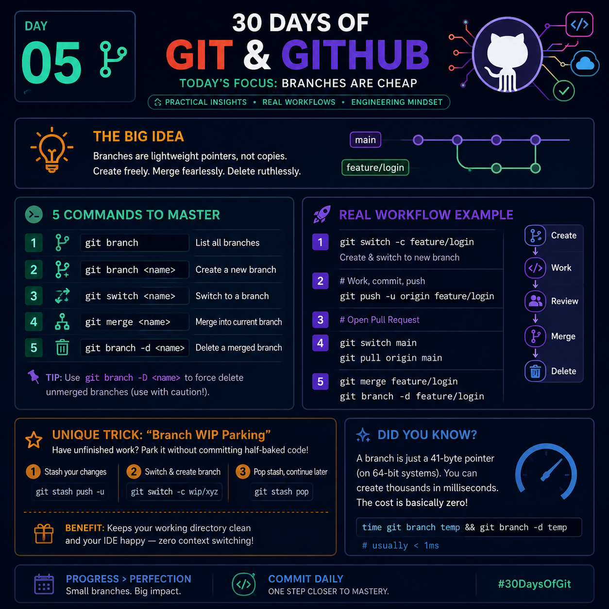

# Day 05 — Branches Are Cheap 🌿

<p align="center">
  
</p>

> **"Professional developers don't fear experimentation because Git branches are almost free."**

---

# 🎯 What You'll Learn

By the end of this lesson, you'll understand:

- Why Git branches are called **"cheap"**
- How Git stores branches internally
- The fastest branch workflow used by professional teams
- Why creating many branches doesn't slow down your repository
- Best practices for feature branches
- A unique productivity trick that most developers never use

---

# 🤔 What Does "Branches Are Cheap" Mean?

Many beginners think that when they create a new branch, Git copies the entire project.

❌ That's **NOT TRUE.**

Git **doesn't duplicate your files.**

Instead, a branch is simply a **pointer** (reference) to a commit.

Example:

```

main
│
▼
A ---- B ---- C

```

Now create a new branch:

```bash
git branch feature-login
```

Internally Git only creates another pointer.

```

main
│
▼
A ---- B ---- C
▲
│
feature-login

```

No files are copied.

No folders are duplicated.

Only a tiny reference is created.

That's why creating a branch takes almost **0 milliseconds**, even inside huge repositories.

---

# 🧠 Git Internals

A Git branch is stored inside:

```

.git/refs/heads/

```

Example:

```

.git/refs/heads/main

```

Content:

```

f4b89b84b19dd2a6d4d...

```

That long value is simply the latest commit hash.

That's all.

A branch is literally just a name pointing to one commit.

---

# 🚀 Why This Makes Git So Fast

Imagine your repository contains

- 500,000 files
- 40 GB project
- 10 years of history

Creating a branch still takes almost the same time because Git **doesn't copy the repository.**

It only creates a new pointer.

That's why professional developers create branches for almost everything.

Examples:

```

feature/login

feature/payment

bugfix/navbar

hotfix/security

experiment/new-ui

refactor/database

```

Creating 100 branches is completely normal.

---

# 📚 Commands You Should Know

## 1️⃣ List all branches

```bash
git branch
```

---

## 2️⃣ Create a branch

```bash
git branch feature-login
```

---

## 3️⃣ Create and switch together

```bash
git switch -c feature-login
```

or

```bash
git checkout -b feature-login
```

---

## 4️⃣ Switch branch

```bash
git switch main
```

---

## 5️⃣ Delete merged branch

```bash
git branch -d feature-login
```

---

## Force delete

```bash
git branch -D feature-login
```

Use this only when you're certain you no longer need the branch.

---

# 🌳 Real Workflow

```

main
│
├───────────────┐
│               │
▼               ▼

Create feature branch

↓

Write code

↓

Commit changes

↓

Push branch

↓

Open Pull Request

↓

Code Review

↓

Merge into main

↓

Delete branch

```

Notice that **main always stays clean**.

---

# 💡 Unique Productivity Trick
## The "Parking Branch" Technique

Sometimes you're halfway through a feature when an urgent bug appears.

Most developers either:

- keep unfinished code
- make a messy commit
- stash everything

Instead, create a temporary parking branch.

```bash
git switch -c parking/payment-work
git add .
git commit -m "WIP: payment module"
```

Now switch back:

```bash
git switch main
```

Fix the urgent issue.

After finishing:

```bash
git switch parking/payment-work
```

Continue exactly where you stopped.

### Why this is powerful

✅ Your work is safely committed

✅ Easy to return later

✅ No huge stash list

✅ History remains organized

This approach is especially useful when working on multiple tasks or switching priorities frequently.

---

# 🔥 Advanced Insight

A branch is **not your work**.

A branch is **only the label** pointing to your work.

The real history lives in the **commits**.

Think like this:

```

Commit = Actual work

Branch = Bookmark

```

Once you understand this idea, many Git commands become much easier to reason about.

---

# ⚡ Pro Tip

Before starting **any** task:

```bash
git switch main
git pull
git switch -c feature/new-feature
```

This ensures your feature branch always starts from the latest version of the project.

---

# 🚫 Common Beginner Mistakes

❌ Working directly on `main`

❌ Creating one branch and using it for every feature

❌ Forgetting to delete merged branches

❌ Naming branches like:

```

test

new

branch1

abc

```

Instead use meaningful names:

```

feature/user-auth

bugfix/navbar

hotfix/payment

docs/readme-update

refactor/api

```

---

# 🧠 Did You Know?

When you create a branch:

- Git does **not** duplicate your project.
- Git does **not** duplicate previous commits.
- Git only creates a lightweight reference to an existing commit.

This design is one of the reasons Git is extremely fast, even for very large repositories.

---

# ⭐ Best Practices

- Create one branch per feature or bug.
- Keep branches short-lived.
- Merge frequently.
- Delete branches after merging.
- Never develop multiple unrelated features in the same branch.
- Use descriptive branch names.
- Keep `main` stable and deployable.

---

# 🏆 Key Takeaways

- ✅ Branches are lightweight references, not copies.
- ✅ Creating branches is almost instantaneous.
- ✅ Commits contain the actual history; branches simply point to commits.
- ✅ Use separate branches for every feature or fix.
- ✅ A clean branching strategy makes collaboration easier and reduces merge conflicts.

---

# 💬 Challenge

1. Create a new repository.
2. Create three branches:
   - `feature/login`
   - `feature/profile`
   - `bugfix/navbar`
3. Add a different commit to each branch.
4. Merge one branch into `main`.
5. Delete the merged branch.
6. Visualize the history with:

```bash
git log --oneline --graph --decorate --all
```

Observe how the branch pointers move while the commits remain intact.

---

### 🚀 One Branch. One Purpose. One Clean History.

**Tomorrow (Day 06): Merge vs Rebase**