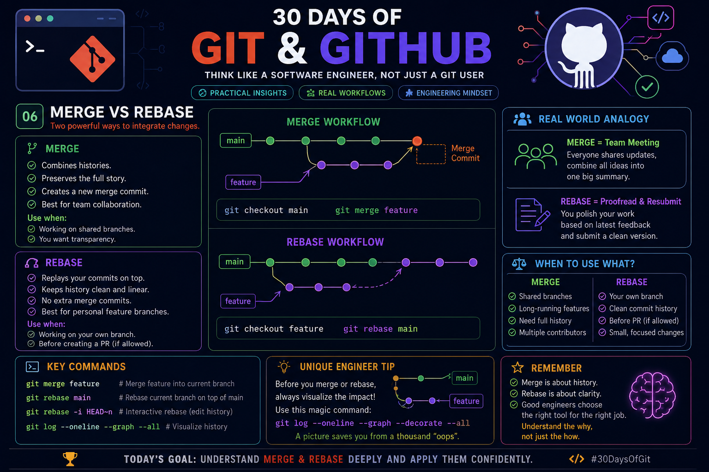

# Day 06 — Merge vs Rebase
> Part of **30 Days of Git & GitHub**

<p align="center">
  
</p>

# 🌳 Merge vs Rebase
Both **Merge** and **Rebase** combine changes from different branches, but they do it in completely different ways.

A good Git engineer doesn't ask:

> **"Which command is better?"**

Instead asks:

> **"Which history do I want to create?"**

---

# 🎯 Learning Goal

By the end of this lesson you should understand:

- What Merge actually does
- What Rebase actually does
- Why professional teams use both
- When NOT to use Rebase
- How to avoid history problems
- How Git internally handles both operations

---

# 🔀 Merge

Merge joins two branches together by creating a **new merge commit**.

Example

```
main

A —— B —— C

feature

      D —— E
```

After Merge

```
A —— B —— C -------- M
       \            /
        D —— E ----
```

Git preserves **both branch histories**.

### Advantages

- Safe
- No history rewriting
- Easy collaboration
- Keeps complete project timeline

### Best For

- Shared branches
- Team collaboration
- Long-running branches
- Production branches

---

# 🔄 Rebase

Rebase moves your commits onto another branch.

Original

```
main

A —— B —— C

feature

      D —— E
```

After Rebase

```
A —— B —— C —— D' —— E'
```

Notice:

Git creates **new commits** (D' and E').

The old commits disappear from branch history.

History becomes linear.

---

# Merge vs Rebase

| Merge | Rebase |
|--------|---------|
| Creates merge commit | No merge commit |
| Preserves history | Rewrites history |
| Easy collaboration | Cleaner history |
| Safe for teams | Best for personal branches |
| Non-linear graph | Linear graph |

---

# What Git Does Internally

## Merge

Git creates

- one new commit

That commit has

```
Parent 1 → main

Parent 2 → feature
```

Nothing else changes.

---

## Rebase

Git

1. Saves your commits

2. Moves HEAD

3. Replays every commit

4. Creates brand new commit hashes

That means

```
Old Commit

A123

↓

New Commit

B456
```

Same code.

Different history.

---

# Why Commit Hashes Change

A Git commit hash depends on

- Parent commit
- Commit message
- Timestamp
- File snapshot

Changing the parent changes the hash.

That is why every rebased commit receives a brand-new SHA.

---

# Real Project Rule

### Merge when

✅ Working with teammates

✅ Branch already pushed

✅ Release branch

✅ Hotfix branch

---

### Rebase when

✅ Cleaning your feature branch

✅ Before opening Pull Request

✅ Local branch only

✅ Nobody else depends on it

---

# 🚫 Never Rebase

Never rebase

- main
- master
- production
- shared release branch

if other developers already pulled it.

Reason

You'll rewrite history and force teammates to resolve unnecessary conflicts.

---

# Useful Commands

Merge

```bash
git checkout main
git merge feature
```

---

Rebase

```bash
git checkout feature
git rebase main
```

---

Interactive Rebase

```bash
git rebase -i HEAD~5
```

---

Visualize History

```bash
git log --oneline --graph --decorate --all
```

This command lets you **see** the branch graph before making history-changing operations.

---

# ⭐ HJ's Unique Trick — S.T.O.R.Y. Rule

Before choosing **Merge** or **Rebase**, ask these five questions:

### **S — Shared?**
Is anyone else using this branch?

### **T — Timeline?**
Do you want to preserve the true development timeline?

### **O — Ownership?**
Is this only your personal feature branch?

### **R — Readability?**
Will a cleaner linear history help reviewers understand your work?

### **Y — Yield?**
Will rewriting history create more benefit than risk?

> **Decision Guide**
>
> - Mostly **Yes** to **Shared** or **Timeline** → **Merge**
> - Mostly **Yes** to **Ownership** and **Readability** → **Rebase**

This isn't a Git command—it's a practical decision framework that helps you choose the right strategy before touching project history.

---

# Common Beginner Mistakes

❌ Rebasing public branches

❌ Force pushing without understanding consequences

❌ Merging every small commit

❌ Ignoring commit history before Pull Requests

❌ Not checking the graph before integrating branches

---

# Interview Questions

### Why does Rebase create new commit hashes?

Because it recreates commits with new parent references.

---

### Which is safer?

Merge.

---

### Which gives cleaner history?

Rebase.

---

### Can Merge and Rebase coexist?

Yes.

Professional teams commonly use:

- Rebase while developing locally
- Merge when integrating into shared branches

---

# Quick Revision

✅ Merge preserves history

✅ Rebase rewrites history

✅ Merge creates a merge commit

✅ Rebase creates new commit hashes

✅ Never rebase public/shared branches

✅ Use `git log --graph` before changing history

---

# Final Takeaway

> **Merge preserves the story. Rebase edits the story.**
>
> Great Git engineers don't choose one forever—they choose the one that best fits the collaboration and the history they want to maintain.