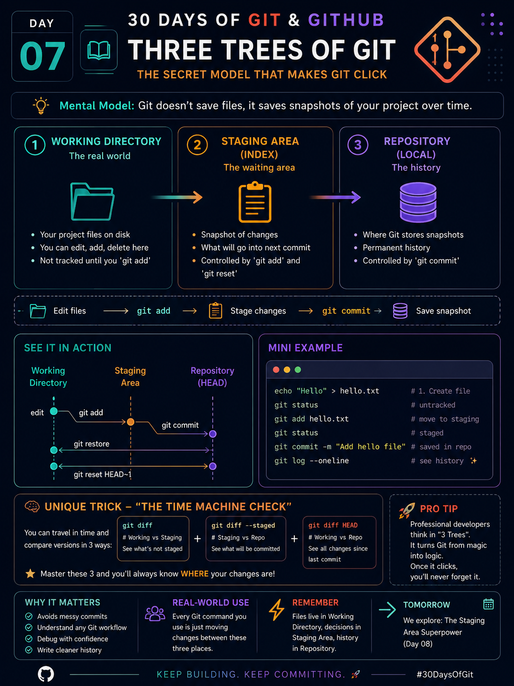

# Day 07 — Three Trees of Git
**The Secret Mental Model That Makes Git Finally Click**

> **Reference Image (Generated Poster):**  
<p align="center">
  
</p>

---

# 🌳 The Three Trees of Git

One of the biggest reasons beginners struggle with Git is because they think Git stores files.

**It doesn't.**

Git stores **snapshots** of your project, and every Git command simply moves changes between **three different places** (called the Three Trees).

Once you understand these three trees, almost every Git command becomes logical instead of something you memorize.

---

# Tree 1 — Working Directory

Think of this as your **actual project folder**.

This is where you:

- Create files
- Edit files
- Delete files
- Rename files

Nothing is saved into Git yet.

Git only notices that something changed.

**Mental Image**

```
Project Folder
│
├── index.html
├── app.js
└── style.css
```

Everything here is your **working copy**.

---

# Tree 2 — Staging Area (Index)

The staging area is like a **shopping cart**.

You choose which changes should become part of the next commit.

```
git add file.js
```

does **NOT**

save your work.

It simply says

> "Include this file in the next snapshot."

---

### Think like this

Working Directory

↓

Choose Changes

↓

Staging Area

---

# Tree 3 — Repository

The repository is your project's permanent history.

When you run

```
git commit
```

Git creates a snapshot from everything inside the staging area.

That snapshot becomes part of history forever.

---

# Complete Flow

```
Edit File

↓

Working Directory

↓

git add

↓

Staging Area

↓

git commit

↓

Repository
```

Every Git command only moves changes between these three places.

---

# Example

Suppose you modify

```
app.js
```

Git now sees

```
Working Directory

Modified:
app.js
```

Now run

```
git add app.js
```

Now

```
Staging Area

Ready:
app.js
```

Now run

```
git commit -m "Update app"
```

Now

```
Repository

Commit Created

Update app
```

---

# The Secret Visualization

Imagine three tables.

```
Table 1

Working Files

↓

Table 2

Prepared Files

↓

Table 3

Saved History
```

Git never skips a table.

Every change travels through these places.

---

# 🔥 The "Time Machine Check" (Unique Mental Trick)

Whenever you're confused, ask yourself one simple question:

> **"Which tree am I looking at?"**

Then use the matching `git diff` command:

| Command | What it compares | Purpose |
|---------|------------------|----------|
| `git diff` | Working Directory ↔ Staging Area | Shows changes **not yet staged** |
| `git diff --staged` | Staging Area ↔ Repository | Shows what **will be committed** |
| `git diff HEAD` | Working Directory ↔ Last Commit | Shows **all changes since the last commit** |

### Memory Shortcut

```
Working → git diff

Staging → git diff --staged

Repository → git diff HEAD
```

Instead of guessing where your changes are, these commands tell you exactly which "tree" you're comparing.

---

# Real-Life Analogy

Imagine writing a book.

### Working Directory

You're writing chapters.

Nothing is finalized.

---

### Staging Area

You place selected chapters into a folder labeled

```
Ready for Publishing
```

---

### Repository

The publisher prints the book.

Once printed, that version becomes part of history.

---

# Why This Matters

Understanding the Three Trees helps you:

- Stop fearing Git commands.
- Understand `git add`, `git commit`, `git restore`, and `git reset`.
- Debug mistakes faster.
- Build a clean commit history.
- Think like an experienced developer instead of memorizing commands.

---

# Commands Used Today

```bash
git status
git add <file>
git commit -m "message"
git diff
git diff --staged
git diff HEAD
```

---

# Key Takeaways

✅ Working Directory = Your current files.

✅ Staging Area = What will be included in the next commit.

✅ Repository = Permanent Git history.

Remember:

> **Git isn't magic. Every command simply moves changes between these three trees.**

---

## Tomorrow (Day 08)

**The Staging Area Superpower**

Learn why professional developers stage changes selectively instead of committing everything at once.