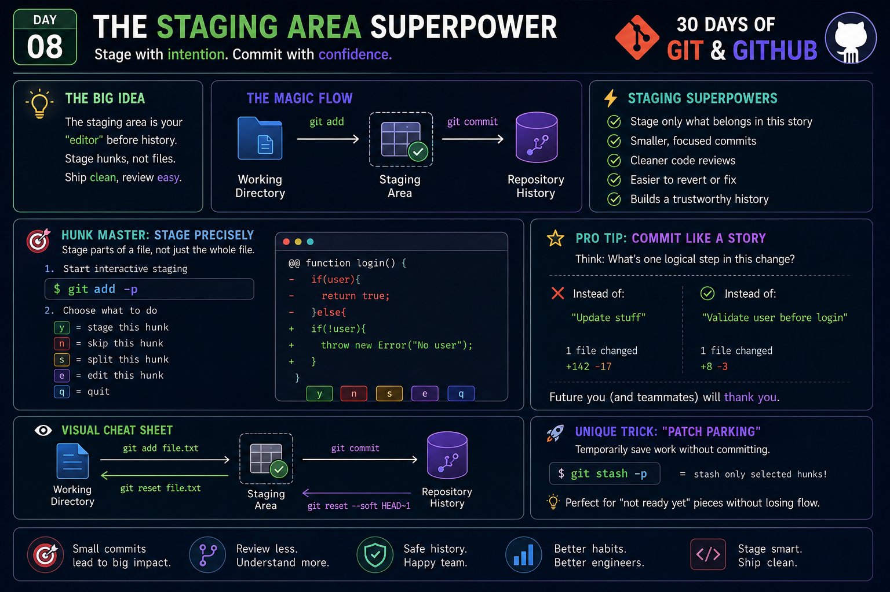

# 🚀 Day 08 – The Staging Area Superpower

<p align="center">
  
</p>

> **Series:** 30 Days of Git & GitHub  
> **Day:** 08  
> **Topic:** The Staging Area Superpower

---

# 📖 Introduction

Many developers use Git every day, but only a few truly understand the **Staging Area**.

Beginners usually think:

```
File → Commit
```

But Git actually works like this:

```
Working Directory
        │
        ▼
 Staging Area
        │
        ▼
 Git Repository
```

The **Staging Area** (also called the **Index**) is Git's secret weapon.

It lets you decide **exactly what should become part of history** before creating a commit.

Think of it as a movie editor.

You don't publish every scene you shoot.

You first choose the best scenes...

Then release the final movie.

Git's staging area works exactly the same way.

---

# 🎯 Why the Staging Area Exists

Imagine you changed one file.

Inside that file you have:

- Fixed a bug
- Improved formatting
- Added logging
- Started another feature

Should all of these become one commit?

❌ No.

Instead, Git allows you to stage only the changes that belong together.

That's why professional developers create clean Git history.

---

# 🧠 The Three States of Git

```
        Edit File
            │
            ▼
    Working Directory
            │
     git add file
            ▼
      Staging Area
            │
      git commit
            ▼
     Git Repository
```

Each step has a different purpose.

### Working Directory

Where you write code.

### Staging Area

Where you prepare history.

### Repository

Permanent project history.

---

# 💡 Why Senior Engineers Love the Staging Area

Without staging:

```
One giant commit
```

With staging:

```
Bug Fix
↓

Documentation

↓

Refactoring

↓

New Feature
```

Every commit tells one story.

That makes debugging much easier.

---

# 🔥 The Real Superpower

Most people stage entire files.

Senior engineers stage **individual pieces of files**.

Example:

```
login.py

✔ Bug Fix

✔ Better variable names

✔ New feature
```

Instead of committing everything...

You can commit only:

```
✔ Bug Fix
```

The remaining changes stay in your working directory.

This creates clean, focused commits.

---

# ⚡ Interactive Staging

Git supports interactive staging.

```bash
git add -p
```

This command shows one change (hunk) at a time.

Git asks:

```
Stage this hunk?

y = yes

n = no

s = split

e = edit

q = quit
```

This is one of the most powerful Git features.

---

# 🎯 Practical Example

Suppose your file contains:

```python
def login(user):

    # Fixed bug
    if user is None:
        return False

    # Added logging
    print("Login")

    # New feature
    send_notification(user)
```

Instead of committing everything,

you can stage only:

```
✔ Bug Fix
```

Later:

```
✔ Logging
```

Later:

```
✔ Notification Feature
```

Three commits.

Three stories.

Easy review.

Easy rollback.

---

# 🚀 Unique Professional Trick

## Patch Parking

Sometimes you're working on a feature...

but suddenly discover a production bug.

Instead of committing unfinished work,

stash only selected hunks.

```bash
git stash -p
```

Now:

```
Unfinished Feature
↓

Saved Temporarily

↓

Fix Production Bug

↓

Return Later
```

This keeps your workflow clean.

Many experienced developers use this every week.

---

# 💎 Commit Like a Story

Bad commit:

```
Updated files
```

Another bad commit:

```
Final changes
```

Even worse:

```
Fix
```

Great commit:

```
Validate user before login
```

Even better:

```
Prevent empty password authentication
```

Every commit should answer:

> **What changed?**

and

> **Why?**

---

# 🧠 Advanced Insight

Think of every commit as a chapter in a book.

A reviewer should understand the story simply by reading commit messages.

If your commit mixes:

- Bug Fix
- Refactoring
- Formatting
- Documentation

Then the story becomes confusing.

Small commits create readable history.

Readable history creates maintainable software.

---

# ⚠ Common Mistakes

### ❌ Committing everything

```
git add .
git commit
```

without reviewing changes.

---

### ❌ Huge commits

```
300 files changed
```

Nobody enjoys reviewing that.

---

### ❌ Mixing unrelated changes

Feature

+

Bug Fix

+

Formatting

into one commit.

---

### ❌ Meaningless commit messages

```
Update

Done

Fix

Changes
```

These provide zero context.

---

# ✅ Best Practices

✔ Stage intentionally

✔ Review before committing

✔ Create one logical commit

✔ Use meaningful commit messages

✔ Keep commits small

✔ Stage by hunk whenever possible

✔ Think about future code reviewers

---

# 🛠 Essential Commands

Stage one file

```bash
git add file.txt
```

Stage everything

```bash
git add .
```

Interactive staging

```bash
git add -p
```

Check staged files

```bash
git status
```

View staged differences

```bash
git diff --cached
```

Unstage a file

```bash
git restore --staged file.txt
```

---

# 💬 Daily Challenge

Open one of your existing Git projects.

Instead of:

```bash
git add .
```

Try:

```bash
git add -p
```

Split your work into **3 meaningful commits**.

Observe how much easier your project history becomes.

---

# 🏆 Key Takeaways

- The Staging Area is Git's editing room before history.
- Clean commits make debugging easier.
- Stage changes, not just files.
- Use `git add -p` to build logical commits.
- Small commits improve collaboration.
- Great Git history starts with intentional staging.

---

# 🚀 Final Thought

> **"Professional developers don't just write clean code—they create clean history."**

Master the Staging Area, and you'll transform your Git workflow from simple version control into a powerful engineering practice.

---

### ⭐ If you found this helpful, follow the **30 Days of Git & GitHub** series and keep building one practical Git skill every day!