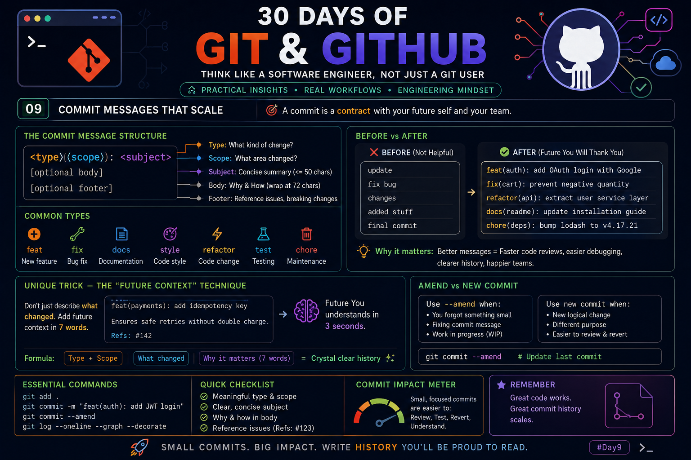

# Day 09 – Commit Messages That Scale

<p align="center">
  
</p>

# 🚀 Commit Messages That Scale

> **"A commit is not just a snapshot of your code. It's a message to every developer—including your future self—explaining *why* this change exists."**

Most developers think commit messages are only useful for tracking history.

Professional engineers know something different.

A great commit message reduces debugging time, speeds up code reviews, improves collaboration, makes rollbacks safer, and documents the evolution of a project.

A bad commit like:

```text
update
fix
changes
done
final
```

tells absolutely nothing.

Six months later, you'll spend hours trying to understand what actually changed.

---

# 🎯 The Real Purpose of a Commit Message

A commit should answer three questions:

✅ What changed?

✅ Why did it change?

✅ What effect will this have?

If your commit only answers the first question, it is incomplete.

---

# ⭐ The Professional Commit Structure

```text
<type>(<scope>): <short summary>

Optional body

Optional footer
```

Example:

```text
feat(auth): add Google OAuth login

Users can now authenticate using Google OAuth.
This reduces signup friction by eliminating password creation.

Refs: #124
```

---

# 📌 Understanding Every Part

## Type

Describes the category of change.

| Type | Meaning |
|-------|----------|
| feat | New feature |
| fix | Bug fix |
| docs | Documentation |
| style | Formatting only |
| refactor | Internal improvement |
| test | Testing changes |
| chore | Maintenance |

---

## Scope

Scope tells **where** the change happened.

Examples

```text
auth
payment
cart
profile
database
api
frontend
backend
```

Instead of

```text
fix bug
```

write

```text
fix(cart): prevent negative quantity
```

Now every developer instantly knows where to look.

---

## Subject

The subject should be

- Present tense
- Short
- Specific
- Under 50 characters whenever possible

Good

```text
fix(api): prevent duplicate requests
```

Bad

```text
Fixed an issue where duplicate requests were happening because of...
```

The details belong in the body.

---

# 🧠 The Body

Many developers skip the body.

Professionals don't.

The body explains

- Why this change exists
- Any side effects
- Design decisions
- Performance improvements
- Known limitations

Example

```text
Previously multiple checkout requests could create duplicate orders.

Added an idempotency key so repeated requests return the same response instead of creating new orders.
```

---

# 📌 Footer

Useful for linking

- GitHub Issues
- Jira Tickets
- Breaking Changes

Example

```text
Refs: #421

BREAKING CHANGE:
JWT token format updated.
```

---

# 🔥 Before vs After

## ❌ Poor History

```text
update

fix

changes

done

working

new commit
```

Nobody understands this history.

---

## ✅ Professional History

```text
feat(auth): add JWT login

fix(cart): prevent duplicate checkout

docs(api): explain authentication flow

refactor(user): remove duplicate validation

test(payment): add refund test cases
```

The project history becomes self-documenting.

---

# 💡 The "Future Context" Technique (High-Value Mental Model)

Here's a powerful habit that experienced engineers often develop naturally:

Before committing, imagine you're investigating a production issue **12 months from now**.

Ask yourself:

> **"If this commit appears in a Git log with no surrounding context, will I immediately understand *why* I made this change?"**

If the answer is **no**, improve the message.

A simple pattern that works well is:

```text
Type
↓

Scope
↓

What changed
↓

Why it matters
```

Example:

```text
feat(payment): add idempotency key

Prevent duplicate payment creation during client retries.

Refs: #142
```

This keeps the commit useful long after the implementation details are forgotten.

---

# ⚡ Commit Granularity Rule

One commit should represent **one logical idea**.

Good

```text
feat(auth): add password reset email
```

Bad

```text
Added login
Updated README
Fixed navbar
Removed logs
Changed API
```

Large mixed commits make

- Reviews harder
- Rollbacks dangerous
- Git bisect less effective

---

# 🔥 When Should You Amend?

Use

```bash
git commit --amend
```

Only when

- Last commit message is incorrect
- Forgot one small file
- Commit has not been pushed

Do NOT amend commits already shared with teammates unless everyone agrees.

---

# ⚡ Small Commits Win

Professional teams prefer

Many small commits

instead of

One giant commit.

Small commits are

- Easier to review
- Easier to revert
- Easier to test
- Easier to understand

---

# 🚀 Engineering Insight

A useful way to think about commits:

> **Every commit is a checkpoint in your project's story.**
>
> If someone reads only the commit history, they should still understand how the software evolved.

That mindset leads to commit messages that remain valuable months or even years later.

---

# ✅ Quick Checklist Before Every Commit

- Meaningful type
- Clear scope
- Short subject
- Explain why if needed
- One logical change
- Easy to revert
- Easy to review
- Easy to understand six months later

---

# 💎 Golden Rule

> **Write commit messages for the developer who will debug your code in the future.**
>
> That developer is very often **you**.

A clean Git history isn't just documentation—it becomes one of the most valuable engineering assets in any project.

---

⭐ **Series:** 30 Days of Git & GitHub  
📅 **Day 09:** Commit Messages That Scale# Day 09 – Commit Messages That Scale

<p align="center">
  
</p>

# 🚀 Commit Messages That Scale

> **"A commit is not just a snapshot of your code. It's a message to every developer—including your future self—explaining *why* this change exists."**

Most developers think commit messages are only useful for tracking history.

Professional engineers know something different.

A great commit message reduces debugging time, speeds up code reviews, improves collaboration, makes rollbacks safer, and documents the evolution of a project.

A bad commit like:

```text
update
fix
changes
done
final
```

tells absolutely nothing.

Six months later, you'll spend hours trying to understand what actually changed.

---

# 🎯 The Real Purpose of a Commit Message

A commit should answer three questions:

✅ What changed?

✅ Why did it change?

✅ What effect will this have?

If your commit only answers the first question, it is incomplete.

---

# ⭐ The Professional Commit Structure

```text
<type>(<scope>): <short summary>

Optional body

Optional footer
```

Example:

```text
feat(auth): add Google OAuth login

Users can now authenticate using Google OAuth.
This reduces signup friction by eliminating password creation.

Refs: #124
```

---

# 📌 Understanding Every Part

## Type

Describes the category of change.

| Type | Meaning |
|-------|----------|
| feat | New feature |
| fix | Bug fix |
| docs | Documentation |
| style | Formatting only |
| refactor | Internal improvement |
| test | Testing changes |
| chore | Maintenance |

---

## Scope

Scope tells **where** the change happened.

Examples

```text
auth
payment
cart
profile
database
api
frontend
backend
```

Instead of

```text
fix bug
```

write

```text
fix(cart): prevent negative quantity
```

Now every developer instantly knows where to look.

---

## Subject

The subject should be

- Present tense
- Short
- Specific
- Under 50 characters whenever possible

Good

```text
fix(api): prevent duplicate requests
```

Bad

```text
Fixed an issue where duplicate requests were happening because of...
```

The details belong in the body.

---

# 🧠 The Body

Many developers skip the body.

Professionals don't.

The body explains

- Why this change exists
- Any side effects
- Design decisions
- Performance improvements
- Known limitations

Example

```text
Previously multiple checkout requests could create duplicate orders.

Added an idempotency key so repeated requests return the same response instead of creating new orders.
```

---

# 📌 Footer

Useful for linking

- GitHub Issues
- Jira Tickets
- Breaking Changes

Example

```text
Refs: #421

BREAKING CHANGE:
JWT token format updated.
```

---

# 🔥 Before vs After

## ❌ Poor History

```text
update

fix

changes

done

working

new commit
```

Nobody understands this history.

---

## ✅ Professional History

```text
feat(auth): add JWT login

fix(cart): prevent duplicate checkout

docs(api): explain authentication flow

refactor(user): remove duplicate validation

test(payment): add refund test cases
```

The project history becomes self-documenting.

---

# 💡 The "Future Context" Technique (High-Value Mental Model)

Here's a powerful habit that experienced engineers often develop naturally:

Before committing, imagine you're investigating a production issue **12 months from now**.

Ask yourself:

> **"If this commit appears in a Git log with no surrounding context, will I immediately understand *why* I made this change?"**

If the answer is **no**, improve the message.

A simple pattern that works well is:

```text
Type
↓

Scope
↓

What changed
↓

Why it matters
```

Example:

```text
feat(payment): add idempotency key

Prevent duplicate payment creation during client retries.

Refs: #142
```

This keeps the commit useful long after the implementation details are forgotten.

---

# ⚡ Commit Granularity Rule

One commit should represent **one logical idea**.

Good

```text
feat(auth): add password reset email
```

Bad

```text
Added login
Updated README
Fixed navbar
Removed logs
Changed API
```

Large mixed commits make

- Reviews harder
- Rollbacks dangerous
- Git bisect less effective

---

# 🔥 When Should You Amend?

Use

```bash
git commit --amend
```

Only when

- Last commit message is incorrect
- Forgot one small file
- Commit has not been pushed

Do NOT amend commits already shared with teammates unless everyone agrees.

---

# ⚡ Small Commits Win

Professional teams prefer

Many small commits

instead of

One giant commit.

Small commits are

- Easier to review
- Easier to revert
- Easier to test
- Easier to understand

---

# 🚀 Engineering Insight

A useful way to think about commits:

> **Every commit is a checkpoint in your project's story.**
>
> If someone reads only the commit history, they should still understand how the software evolved.

That mindset leads to commit messages that remain valuable months or even years later.

---

# ✅ Quick Checklist Before Every Commit

- Meaningful type
- Clear scope
- Short subject
- Explain why if needed
- One logical change
- Easy to revert
- Easy to review
- Easy to understand six months later

---

# 💎 Golden Rule

> **Write commit messages for the developer who will debug your code in the future.**
>
> That developer is very often **you**.

A clean Git history isn't just documentation—it becomes one of the most valuable engineering assets in any project.

---

⭐ **Series:** 30 Days of Git & GitHub  
📅 **Day 09:** Commit Messages That Scale