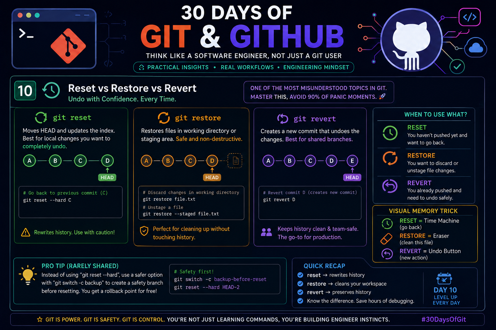

# Day 10 – Reset vs Restore vs Revert
## Master Git's Undo Commands Like a Software Engineer

<p align="center">
  
</p>

> **"The biggest Git mistake isn't deleting code—it's using the wrong undo command."**

Most developers know that Git has multiple ways to undo changes, but few understand **why Git provides three different commands**. Professional developers don't memorize commands—they understand **which layer of Git each command affects**.

This guide explains not only **what** each command does but also **how to think about them**, enabling you to make the correct decision in seconds.

---

# Why Does Git Have Three Undo Commands?

Git manages your project in **three different layers**:

```
Working Directory
        │
        ▼
Staging Area (Index)
        │
        ▼
Commit History
```

Every undo command targets a different layer.

| Command | Changes Files | Changes Staging | Changes Commit History |
|----------|---------------|----------------|-------------------------|
| `git restore` | ✅ Yes | ✅ Yes | ❌ Never |
| `git reset` | ✅ Optional | ✅ Yes | ✅ Yes |
| `git revert` | ❌ No | ❌ No | ✅ Adds a new commit |

**Golden Rule**

> Before undoing anything, ask yourself:

> **"Do I want to undo a file, a staged change, or an entire commit?"**

The answer tells you which command to use.

---

# 1. git reset

## Purpose

`git reset` moves the branch pointer (**HEAD**) backward or forward.

Unlike many commands, it can rewrite Git history.

It is mainly used for:

- Removing recent commits
- Reorganizing local history
- Cleaning unfinished work
- Recovering before pushing

Example:

```bash
git reset --soft HEAD~1
```

Moves HEAD back one commit while keeping your changes staged.

---

## Reset Modes

### Soft Reset

```
History ← moved
Stage   ← kept
Files   ← kept
```

```bash
git reset --soft HEAD~1
```

Use when:

- Commit message is wrong
- Want to combine commits
- Need to recommit

---

### Mixed Reset (Default)

```
History ← moved
Stage   ← cleared
Files   ← kept
```

```bash
git reset HEAD~1
```

Use when:

- Want to edit files before recommitting.

---

### Hard Reset

```
History ← moved
Stage   ← deleted
Files   ← deleted
```

```bash
git reset --hard HEAD~1
```

Use carefully.

It permanently removes uncommitted work.

---

# 2. git restore

Introduced to separate **file restoration** from history manipulation.

Unlike reset,

> **Restore never changes Git history.**

It only affects files.

Examples:

Restore one file

```bash
git restore app.py
```

Restore every modified file

```bash
git restore .
```

Unstage a file

```bash
git restore --staged app.py
```

---

## Best Use Cases

✔ Accidentally edited a file

✔ Remove temporary debugging code

✔ Unstage files

✔ Restore deleted files

---

# 3. git revert

Revert is the safest undo command.

Instead of deleting history,

Git creates **a new commit** that reverses an earlier commit.

Example

```bash
git revert 82fe91a
```

History remains complete.

```
A → B → C → D
        │
        ▼
A → B → C → D → E

E reverses D
```

Perfect for:

- Shared repositories
- Production branches
- Team projects
- Open Source

---

# The Engineering Decision Tree

```
Need to undo?

        │
        ▼

Only one file?
        │
      YES
        │
git restore

──────────────

Need to remove local commit?

        │
      YES
        │
git reset

──────────────

Already pushed?

        │
      YES
        │
git revert
```

This mental workflow helps engineers choose correctly without memorizing every option.

---

# Visual Memory Trick

Think of Git like editing a movie.

🎬 **git reset**

Moves the movie timeline backward.

You pretend a scene never existed.

---

🧽 **git restore**

Repairs one damaged scene.

The movie timeline never changes.

---

↩ **git revert**

Adds a brand-new correction scene.

The audience sees both the mistake and the fix.

This analogy is extremely useful during interviews and real projects.

---

# Professional Workflow

Imagine this situation.

```
Commit A
Commit B
Commit C
```

### You haven't pushed yet.

Use:

```bash
git reset --soft HEAD~1
```

Edit.

Commit again.

History stays clean.

---

### You already pushed.

Never use:

```bash
git reset --hard
```

Instead:

```bash
git revert HEAD
```

Your teammates stay synchronized.

---

# Rarely Shared Professional Trick

Instead of doing this:

```bash
git reset --hard HEAD~3
```

Create a temporary recovery branch first.

```bash
git switch -c backup-before-reset
```

Then reset.

```bash
git reset --hard HEAD~3
```

Why?

If you reset the wrong commit, your backup branch still contains every commit.

This tiny habit can save hours of recovery work and is commonly used by experienced engineers before performing destructive history operations.

---

# Common Mistakes

❌ Using `git reset --hard` after pushing.

❌ Confusing `restore` with `reset`.

❌ Deleting history on shared branches.

❌ Forgetting to check `git status`.

❌ Not reviewing commit history before undoing.

---

# Quick Comparison

| Situation | Best Command |
|------------|--------------|
| Remove latest local commit | `git reset` |
| Restore deleted file | `git restore` |
| Unstage a file | `git restore --staged` |
| Undo pushed commit | `git revert` |
| Clean working directory | `git restore .` |
| Rewrite local history | `git reset` |
| Safe team collaboration | `git revert` |

---

# Engineer's Checklist Before Undoing

✔ Has the commit already been pushed?

✔ Am I changing project history?

✔ Do teammates depend on this commit?

✔ Can I recover if something goes wrong?

✔ Did I check `git status`?

✔ Did I review `git log --oneline`?

These six questions prevent most Git mistakes.

---

# Key Takeaways

- **`git restore`** fixes files without touching history.
- **`git reset`** rewrites local history and should be used carefully.
- **`git revert`** creates a new commit that safely undoes previous changes.
- Prefer **`revert`** on shared branches and **`reset`** only for local work.
- Always think about **which Git layer** you're modifying: Working Directory, Staging Area, or Commit History.
- Create a **temporary backup branch** before destructive resets for an easy recovery path.

---

# Final Thought

Git is not just a version control tool—it is a history management system.

The best engineers don't ask:

> **"Which command removes my mistake?"**

They ask:

> **"Which command preserves the integrity of my project's history while solving the problem?"**

Mastering this mindset is what separates a Git user from a Git engineer.

---

## #30DaysOfGit #Git #GitHub #SoftwareEngineering #VersionControl #OpenSource #DevOps