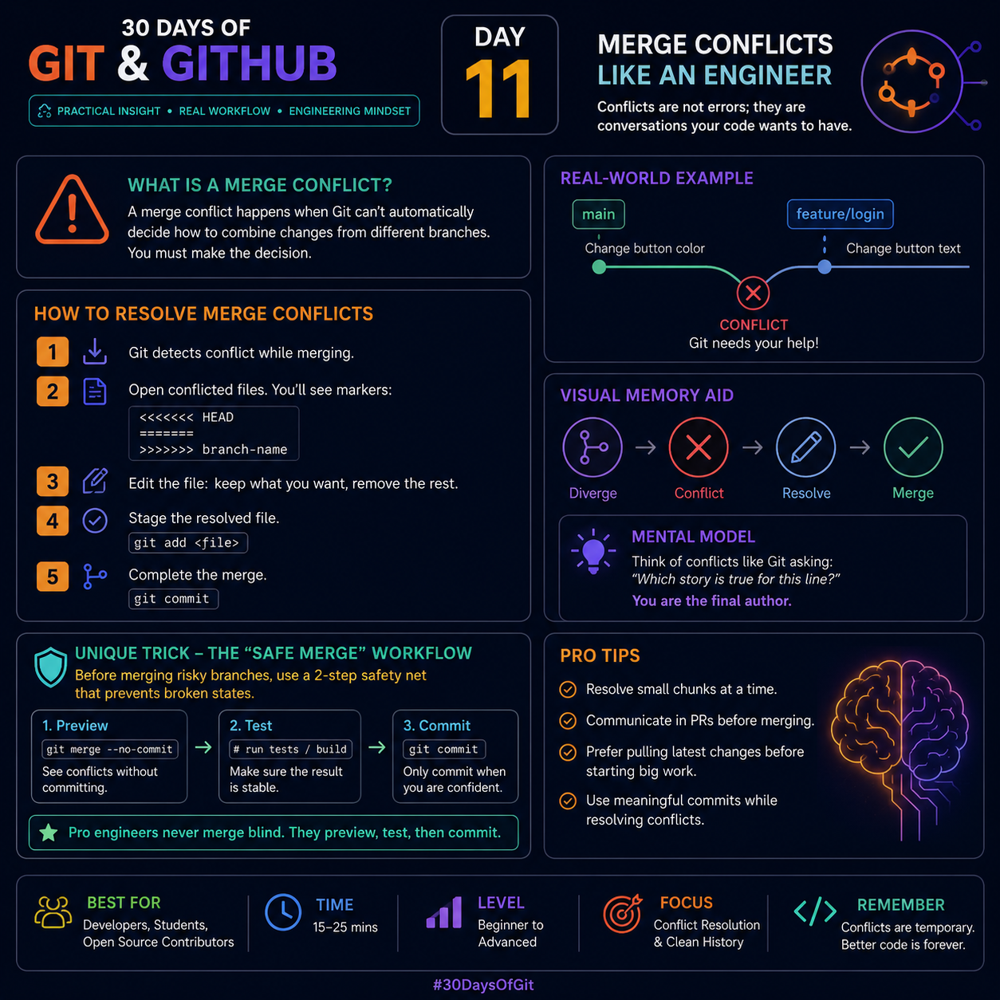

# Day 11 – Merge Conflicts Like an Engineer

> **30 Days of Git & GitHub**

**Image Reference**

<p align="center">
  
</p>


---

# 🎯 Learning Objective

By the end of this lesson, you will understand:

- Why merge conflicts happen
- How Git detects conflicts
- How to resolve conflicts professionally
- How experienced engineers avoid unnecessary conflicts
- A workflow that makes conflict resolution safe and predictable

---

# 🧠 Engineer's Mindset

Many beginners think a merge conflict means something is broken.

**That's completely wrong.**

A merge conflict actually means:

> Git successfully detected that two developers changed the same part of the project and refused to guess which version is correct.

Git protects your code.

It asks the developer to make the final decision.

**Remember:**

> Git manages history.
>
> Developers manage business logic.

---

# 📖 What is a Merge Conflict?

A merge conflict occurs when Git cannot automatically combine changes from two branches.

Git performs automatic merges whenever possible.

However, Git stops and asks for help when multiple changes affect the same code in incompatible ways.

Example:

Main Branch

```python
button.color = "blue"
```

Feature Branch

```python
button.color = "green"
```

Git cannot decide whether the final color should be blue or green.

Instead of making a wrong decision, Git pauses the merge.

---

# 🚨 Common Reasons Merge Conflicts Occur

### 1. Same Line Edited

Two developers modify the exact same line.

Example

Developer A

```python
price = 100
```

Developer B

```python
price = 120
```

Git cannot choose.

---

### 2. One Deletes, Another Modifies

Developer A

Deletes:

```python
login.py
```

Developer B

Adds 200 new lines inside `login.py`.

Git cannot know whether the file should exist.

---

### 3. Different Renames

Developer A

```
user.py → account.py
```

Developer B

```
user.py → customer.py
```

Git needs your decision.

---

# 🔍 Understanding Conflict Markers

Git inserts temporary markers inside the file.

Example

```text
<<<<<<< HEAD
button.color = "blue"
=======
button.color = "green"
>>>>>>> feature/login
```

Meaning

| Marker | Meaning |
|---------|----------|
| `<<<<<<< HEAD` | Current branch |
| `=======` | Separator |
| `>>>>>>> feature/login` | Incoming branch |

These markers are **not valid code**.

They must be removed before committing.

---

# ✅ Professional Conflict Resolution Workflow

## Step 1

Start the merge.

```bash
git merge feature/login
```

If Git detects conflicts:

```
Automatic merge failed.
Fix conflicts and commit the result.
```

---

## Step 2

Find conflicted files.

```bash
git status
```

Output

```
both modified:
login.py
```

---

## Step 3

Open every conflicted file.

Read both versions carefully.

Decide whether to keep:

- Your code
- Their code
- Both combined

Never choose blindly.

---

## Step 4

Remove conflict markers.

Before

```text
<<<<<<< HEAD
print("Blue")
=======
print("Green")
>>>>>>> feature/login
```

After

```python
print("Green")
```

or

```python
print("Blue")
print("Green")
```

depending on the requirement.

---

## Step 5

Stage resolved files.

```bash
git add login.py
```

---

## Step 6

Complete the merge.

```bash
git commit
```

Git automatically creates a merge commit.

---

# ⭐ Unique Engineering Workflow (Safe Merge)

Most tutorials immediately recommend:

```bash
git merge feature/login
```

Professional teams often prefer:

```bash
git merge --no-commit feature/login
```

Why?

It allows you to:

- inspect every merged file
- run tests
- verify builds
- review code
- cancel safely if something looks wrong

Only after verification:

```bash
git commit
```

If the merge is incorrect:

```bash
git merge --abort
```

This returns the repository to its previous state.

### Why this matters

Think of it as a **Preview Mode** for merging.

Instead of committing first and fixing later,

Professional engineers:

> Preview → Test → Commit

This simple habit prevents many production bugs.

---

# 💡 Hidden Insight

Git does **not** compare commits.

Git compares **snapshots of files**.

During a merge Git performs a **three-way comparison**:

- Common ancestor
- Current branch
- Incoming branch

If both branches modify the same section differently,

Git raises a conflict.

Understanding this explains **why conflicts occur even when commits are different.**

---

# 🧠 Mental Model

Imagine two authors editing the same paragraph.

Editor A writes:

> The hero wins.

Editor B writes:

> The hero loses.

A computer cannot decide which story is correct.

Git simply asks:

> "Which version should become the final story?"

That's exactly what a merge conflict is.

---

# ⚡ Pro Tips

### Pull before creating large features

```bash
git pull
```

Smaller differences produce fewer conflicts.

---

### Commit frequently

Large commits create larger conflicts.

Small commits are easier to merge.

---

### Resolve one file at a time

Don't open twenty conflicted files simultaneously.

Finish one.

Test.

Continue.

---

### Run tests immediately

Example

```bash
pytest
```

or

```bash
npm test
```

Many merge conflicts compile successfully but break application logic.

---

### Write a meaningful merge commit

Avoid

```
fixed
```

Better

```
Resolve login module merge conflict
```

Future developers will thank you.

---

# 🚫 Common Mistakes

❌ Accepting one version without reading.

❌ Leaving conflict markers in the code.

❌ Forgetting to test.

❌ Solving every conflict first and testing later.

❌ Mixing unrelated code changes while resolving conflicts.

---

# 🎯 Interview Questions

### Q1

Why does Git create merge conflicts?

**Answer**

Because Git cannot determine the developer's intended final version when multiple incompatible changes affect the same code.

---

### Q2

How can you cancel an unfinished merge?

```bash
git merge --abort
```

---

### Q3

How do you see conflicted files?

```bash
git status
```

---

### Q4

What is the purpose of `git merge --no-commit`?

It performs the merge but waits before creating the merge commit, allowing developers to review and test changes first.

---

# 🏋 Practice Exercise

1. Create two branches.

```bash
git checkout -b featureA
```

```bash
git checkout -b featureB
```

2. Modify the same line in both branches.

3. Merge them.

4. Observe the conflict.

5. Resolve it.

6. Test the application.

7. Commit the merge.

Repeat until conflict resolution feels natural.

---

# 📌 Key Takeaways

- Merge conflicts are not errors.
- Git refuses to guess your intent.
- Always understand both versions before resolving.
- Preview → Test → Commit is a safer workflow than merging blindly.
- Small commits and frequent pulls reduce conflicts.
- The goal is not just to remove conflict markers—it is to preserve the correct business logic.

---

# 💬 Quote of the Day

> **"Merge conflicts are conversations between two histories. Great engineers don't silence the conversation—they make the best decision."**

---

**Series:** 30 Days of Git & GitHub  
**Day:** 11 – Merge Conflicts Like an Engineer