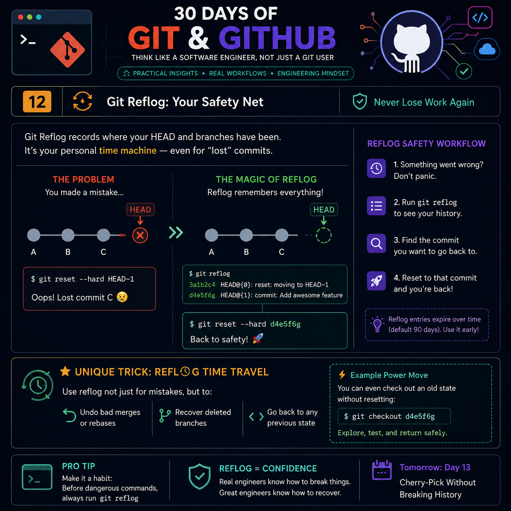

# 🚀 Day 12 — Git Reflog: Your Safety Net

<p align="center">
  
</p>

<p align="center">
  
</p>


---

# 🧠 Think Like an Engineer

> **Good developers know Git commands.**
>
> **Great engineers know how to recover from mistakes.**

Git Reflog is the hidden recovery system inside Git.

Whenever HEAD or a branch moves, Git secretly records that movement.

Even after running dangerous commands like

```
git reset --hard
```

your work usually isn't gone.

Git remembers.

That memory is called **Reflog**.

---

# 📖 What is Git Reflog?

Git Reflog is a **local history of every movement of HEAD and branch references.**

Unlike `git log`, which only displays commits that are part of the current history,

**Reflog records where your repository has been.**

Run:

```bash
git reflog
```

Example:

```text
3d91ef4 HEAD@{0}: reset: moving to HEAD~1
61b8d92 HEAD@{1}: commit: Added Login Page
ab834dc HEAD@{2}: checkout: moving from feature/auth to main
```

Every line represents a previous state of your repository.

---

# 🎯 Why Git Reflog Exists

Imagine this timeline

```
A → B → C → D
             ↑
           HEAD
```

Now someone accidentally runs

```bash
git reset --hard HEAD~2
```

Current history becomes

```
A → B
      ↑
    HEAD
```

Most developers think

❌ Commit C is gone

❌ Commit D is gone

Actually

Git still remembers where HEAD was.

Git Reflog still contains

```
HEAD@{1} → Commit D
```

That's why recovery is possible.

---

# ⚡ Git Log vs Git Reflog

| Git Log | Git Reflog |
|---------|------------|
| Shows commit history | Shows movement history |
| Shared with everyone | Only exists locally |
| Permanent | Temporary |
| Used for project history | Used for recovery |
| Doesn't remember resets | Remembers resets |

---

# 🔍 What Exactly Does Reflog Store?

Many developers believe Reflog stores commits.

That is **incorrect.**

Git Reflog stores

✅ HEAD movements

✅ Branch pointer movements

✅ Checkout operations

✅ Merge operations

✅ Reset operations

✅ Rebase operations

This tiny difference explains why Git can recover "deleted" commits.

---

# 🛠 Common Recovery Scenarios

---

## 1️⃣ Undo an Accidental Reset

Mistake

```bash
git reset --hard HEAD~1
```

Recovery

```bash
git reflog
```

Output

```
HEAD@{1}
```

Recover

```bash
git reset --hard HEAD@{1}
```

Done.

---

## 2️⃣ Recover Deleted Branch

Deleted

```bash
git branch -D feature-login
```

Find its last commit

```bash
git reflog
```

Create again

```bash
git checkout -b feature-login HEAD@{5}
```

---

## 3️⃣ Undo a Bad Rebase

After a failed rebase

```bash
git reflog
```

Find

```
rebase started
```

Recover

```bash
git reset --hard HEAD@{before-rebase}
```

---

## 4️⃣ Recover Detached HEAD

Mistake

```bash
git checkout abc123
```

You forgot to create a branch.

Later

Git warns

```
You are leaving commits behind...
```

Recovery

```bash
git reflog
```

Create

```bash
git checkout -b recovered-work HEAD@{1}
```

Nothing lost.

---

# 💎 Hidden Engineering Insight

Git never immediately deletes commits.

It simply removes references.

Until Git Garbage Collection runs,

those commits still exist inside Git's object database.

Reflog simply remembers where those references pointed.

This is why recovery works.

---

# 🚀 Unique Pro Tip

Instead of remembering commit hashes,

remember **HEAD positions.**

For example

```
HEAD@{0}
HEAD@{1}
HEAD@{2}
HEAD@{3}
```

These are often faster to use than copying long SHA hashes.

Example

Instead of

```bash
git checkout 3d91ef492983...
```

Use

```bash
git checkout HEAD@{3}
```

Cleaner.

Faster.

Easier.

---

# 📌 Reflog Expiration

Git doesn't keep Reflog forever.

Default values

Reachable commits

```
90 Days
```

Unreachable commits

```
30 Days
```

Check

```bash
git config --get gc.reflogExpire
```

```bash
git config --get gc.reflogExpireUnreachable
```

---

# 🧩 Professional Workflow

Whenever something goes wrong

```
Don't Panic
      │
      ▼
Run git reflog
      │
      ▼
Locate previous HEAD
      │
      ▼
Checkout or Reset
      │
      ▼
Continue Working
```

---

# ⚠ Common Mistakes

❌ Thinking Git permanently deleted your commits.

❌ Running more Git commands before checking Reflog.

❌ Forgetting Reflog is local only.

❌ Waiting weeks before recovery.

---

# 🏆 Commands Every Engineer Should Memorize

```bash
git reflog
```

```bash
git reset --hard HEAD@{1}
```

```bash
git checkout HEAD@{4}
```

```bash
git branch recovered HEAD@{5}
```

```bash
git show HEAD@{2}
```

---

# 🧠 Engineering Mindset

Professional developers don't avoid mistakes.

They build systems that make mistakes recoverable.

Git Reflog is one of those systems.

Master it,

and you'll never fear Git again.

---

# 🎯 Key Takeaways

✅ Reflog is your personal Git recovery journal.

✅ It records reference movements instead of commit history.

✅ It helps recover from reset, rebase, checkout, and branch deletion.

✅ It is local to your machine.

✅ It expires over time.

✅ It is one of the most valuable Git features every engineer should master.

---

# 📚 Practice Challenge

Try these in a test repository:

- Create three commits.
- Run `git reset --hard HEAD~2`.
- Recover the lost commits using `git reflog`.
- Delete a branch and recreate it using Reflog.
- Perform an interactive rebase, then restore the previous state.

---

# 🔥 Quote of the Day

> **"The best Git users aren't those who never make mistakes—they're the ones who know exactly how to recover from them."**

---

⭐ **If you found this helpful, consider starring the repository and follow the complete _30 Days of Git & GitHub_ series!**