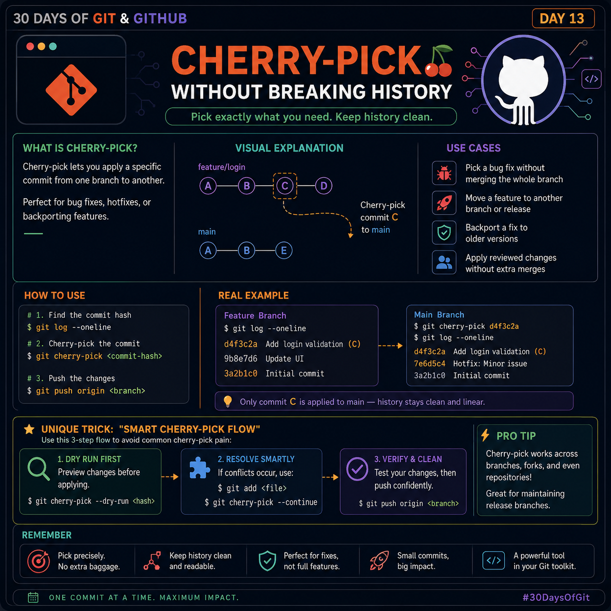

# 🍒 Day 13: Cherry-Pick Without Breaking History



> **"Copy only the commit you need—not the entire branch."**

Cherry-pick is one of Git's most powerful commands. Instead of merging an entire branch, it allows you to apply **one or more specific commits** from another branch while keeping your project's history clean and intentional.

Many developers think Cherry-Pick is simply a "copy commit" command.

Professional engineers use it as a **history selection tool**.

---

# 🎯 What You'll Learn

- What Cherry-Pick actually does
- When to use it
- When NOT to use it
- Real-world workflow
- Advanced engineering tips
- Common mistakes
- A mental model that makes Cherry-Pick easy forever

---

# 🤔 What is Cherry-Pick?

Cherry-Pick copies **the changes introduced by a specific commit** and creates a **new commit** on your current branch.

It **does not** copy branch history.

Think of it like this:

```
Merge
Copies everything

Feature Branch
A → B → C → D

↓

Main
A → B → C → D
```

Cherry-Pick

```
Feature Branch
A → B → C → D

             ↓

Main
A → X → Y → C'
```

Only **commit C** is applied.

Git creates a **new commit with a different SHA** because history has changed.

---

# 💡 When Should You Use Cherry-Pick?

Cherry-Pick is perfect when you only need one change.

Examples include:

✅ Critical bug fixes

✅ Hotfixes

✅ Backporting fixes to older releases

✅ Moving one completed feature

✅ Applying reviewed code without merging unfinished work

---

# ❌ When You Should Avoid Cherry-Pick

Don't Cherry-Pick when:

- You need the entire branch
- Commits depend on each other
- The feature contains many related commits
- Merge or Rebase is the better solution

Rule of thumb:

> **Cherry-Pick commits, Merge branches.**

---

# ⚙ Basic Command

```bash
git cherry-pick <commit-hash>
```

Example

```bash
git cherry-pick d4f3c2a
```

Git copies the changes and creates a new commit.

---

# 🛠 Finding the Commit

Use:

```bash
git log --oneline
```

Example

```text
d4f3c2a Add login validation
98be7d6 Update dashboard
3a2b1c0 Initial commit
```

Then:

```bash
git cherry-pick d4f3c2a
```

Done.

---

# 🔥 Real Engineering Example

Imagine:

```
feature/login
```

contains

```
✔ Login validation
✔ Dark mode
✔ Analytics
✔ Notifications
```

Production only needs the login fix.

Instead of merging everything:

```
git cherry-pick d4f3c2a
```

Only the login validation reaches production.

No unfinished work.

No unnecessary merge.

---

# 🧠 Engineering Mental Model

Think of commits as LEGO bricks.

Merge says:

> "Bring the entire LEGO model."

Cherry-Pick says:

> "Give me only the blue brick."

That is exactly what professional teams do during emergency releases.

---

# ⚡ Advanced Workflow

## Step 1

Locate commit

```bash
git log --oneline
```

---

## Step 2

Apply commit

```bash
git cherry-pick <hash>
```

---

## Step 3

If conflict occurs

Resolve files

```bash
git add .
```

Continue

```bash
git cherry-pick --continue
```

Abort

```bash
git cherry-pick --abort
```

---

# 🚀 Lesser-Known (But Extremely Useful) Trick

## Cherry-Pick Multiple Commits

Instead of running Cherry-Pick multiple times:

```bash
git cherry-pick A B C
```

Or

```bash
git cherry-pick A^..D
```

Git applies all commits in order.

Very useful during release preparation.

---

# ⭐ Valuable Engineering Insight

Most developers Cherry-Pick based on **commit hashes**.

Experienced engineers first ask:

> **"Is this commit independent?"**

A commit is safe to Cherry-Pick if it:

- Compiles independently
- Doesn't rely on previous commits
- Doesn't require future commits
- Doesn't change shared architecture unexpectedly

Thinking this way dramatically reduces conflicts.

---

# ⚠ Common Mistakes

### ❌ Cherry-Picking dependent commits

Result:

Broken code

---

### ❌ Cherry-Picking merge commits without understanding parents

Use:

```bash
git cherry-pick -m 1 <merge-commit>
```

only when you understand merge parents.

---

### ❌ Forgetting tests

Cherry-Pick copies code.

It does **not** guarantee compatibility.

Always run:

- Unit Tests
- Integration Tests
- Build Validation

---

# 🏆 Pro Tip

Before Cherry-Picking into production, compare commits:

```bash
git show <hash>
```

Review exactly what will be copied.

This simple habit prevents accidental production bugs.

---

# 🧩 Hidden Productivity Tip

If you're Cherry-Picking frequently between the same branches, it usually indicates a workflow issue.

Instead of repeatedly Cherry-Picking, ask:

- Should this code live in a shared branch?
- Is the feature too large?
- Can commits be made smaller?

Good Git history reduces the need for Cherry-Pick.

---

# 📌 Best Practices

✅ Keep commits small

✅ One logical change per commit

✅ Write meaningful commit messages

✅ Run tests before pushing

✅ Cherry-Pick only independent commits

✅ Prefer Merge for completed features

---

# 🧠 Quick Cheat Sheet

| Task | Command |
|------|---------|
| Cherry-Pick commit | `git cherry-pick <hash>` |
| Continue after conflict | `git cherry-pick --continue` |
| Abort operation | `git cherry-pick --abort` |
| Apply multiple commits | `git cherry-pick A B C` |
| View commit | `git show <hash>` |
| Find commit | `git log --oneline` |

---

# 🎯 Key Takeaways

- Cherry-Pick copies commits, not branches.
- It creates a new commit with a new SHA.
- Best for hotfixes and selective changes.
- Avoid using it for large features.
- Small independent commits make Cherry-Pick incredibly powerful.
- Think like an engineer: **move only what is necessary.**

---

## 💬 Challenge

Create two branches.

Make three commits on one branch.

Cherry-Pick only the second commit into `main`.

Observe how Git creates a **new commit** while preserving a clean history.

---

### 🚀 Series Progress

✅ Day 13 Complete

Next Up:

**Day 14 — Interactive Rebase: Rewrite History Like a Pro**

---

### ⭐ If this helped you

Follow **CodewalaLife** for more practical Git & GitHub engineering content.

**One Commit a Day. One Step Closer to Mastery.**