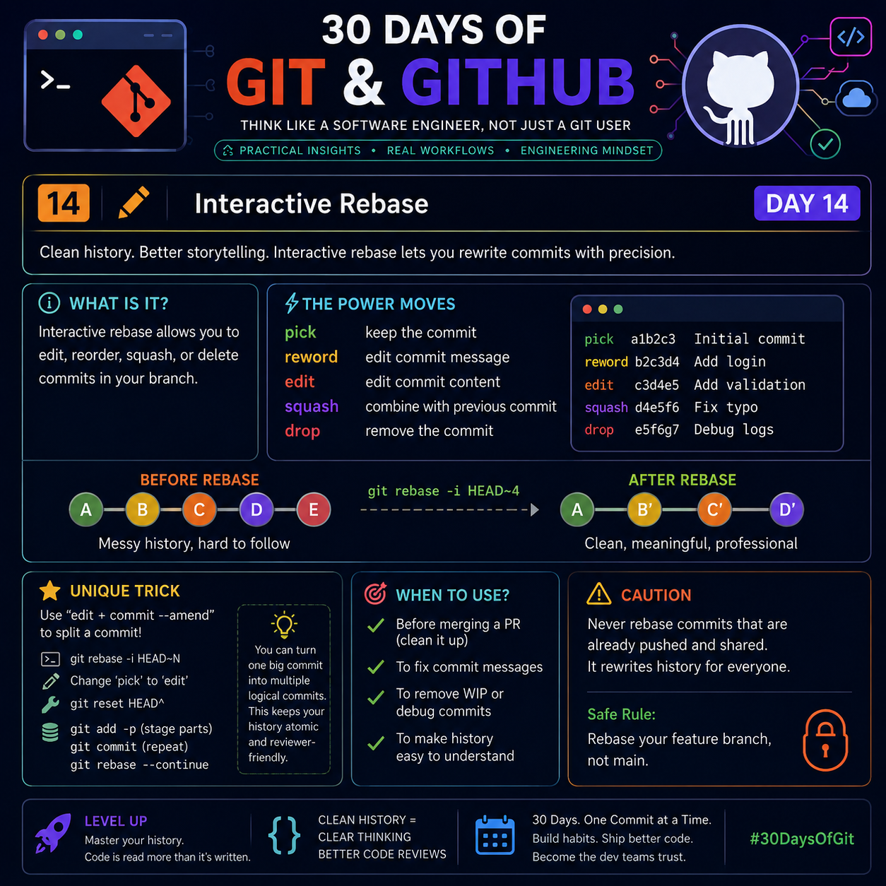

# Day 14 — Interactive Rebase
> **Think Like a Software Engineer, Not Just a Git User**



---

# What You'll Learn

Interactive Rebase is one of Git's most powerful features.

Most developers think it is only used to **squash commits**.

Professional engineers use it to:

- Build a readable project history
- Separate unrelated work
- Improve code review quality
- Remove development noise
- Tell the story of how software evolved

A clean Git history is documentation.

---

# Why Interactive Rebase Exists

While developing, commits are usually messy.

Example:

```
Fix login
forgot semicolon
debug
test
works now
another fix
```

These commits make sense while coding.

They do **not** make sense six months later.

Interactive Rebase lets you rewrite history **before sharing it** so your teammates only see meaningful commits.

Instead of showing *every thought*, you show the final engineering process.

---

# The Engineering Mindset

A commit is not a save point.

A commit is a chapter in your project's story.

Every commit should answer:

- Why was this change made?
- What problem does it solve?
- Can someone safely revert only this commit?

If the answer is "No", your history probably needs rebase.

---

# Basic Command

```bash
git rebase -i HEAD~5
```

Meaning:

```
Open the last five commits
and allow editing before replaying them.
```

Git opens something like:

```
pick 7d32a Add Login Page
pick e231d Fix CSS
pick a98fd Debug
pick 982aa Remove Console
pick b91ef Update README
```

Now every line can be modified.

---

# Every Interactive Rebase Command Explained

---

## pick

Keep the commit exactly as it is.

```
pick 7d32a Add Login
```

No changes.

Use when the commit is already good.

---

## reword

Keep the code.

Change only the commit message.

Example

Before

```
Fix
```

After

```
Fix login authentication timeout issue
```

The code remains identical.

---

## edit

Pause during rebase.

Allows changing the commit itself.

Useful for:

- adding forgotten files
- removing files
- splitting commits
- correcting mistakes

Example

```
edit 8e12a Login
```

Git pauses.

You modify files.

Then:

```bash
git add .
git commit --amend
git rebase --continue
```

---

## squash

Merge this commit into the previous one.

Example

Before

```
Add Login
Fix Login
Improve Login
```

After

```
Add complete Login System
```

Three commits become one logical unit.

---

## fixup

Almost identical to squash.

Difference:

```
fixup
```

Automatically removes the second commit message.

Perfect for typo fixes.

---

## drop

Delete the commit completely.

Example

```
drop e82a temporary debug
```

Commit disappears.

Useful for:

- debug logs
- accidental commits
- temporary experiments

---

# The Secret Professional Workflow

Instead of this:

```
Add Login

Fix Login

Fix Login Again

Forgot CSS

Forgot Validation

Console Remove

Final Fix

Really Final Fix
```

Professionals transform it into:

```
Create Login Feature

Add Validation

Improve Styling

Update Documentation
```

Same code.

Far better history.

---

# The "Atomic Commit" Principle

One commit

=

One idea

Bad

```
Add Login

Fix Navbar

Update README

Delete Images

```

Multiple unrelated changes.

Good

```
Implement Login Authentication
```

Everything inside relates to one feature.

Atomic commits make:

- debugging easier
- reverting safer
- reviewing faster

---

# Little-Known Technique:
# Split One Huge Commit into Multiple Logical Commits

Most tutorials stop at squash.

Professionals often do the opposite.

Suppose one commit contains:

```
Login
Dashboard
Settings
Profile
```

One giant commit.

Use

```
git rebase -i
```

Change

```
pick
```

to

```
edit
```

Then

```bash
git reset HEAD^
```

This removes the commit but keeps all file changes.

Now create logical commits:

```bash
git add login/
git commit

git add dashboard/
git commit

git add settings/
git commit

git add profile/
git commit
```

Continue

```bash
git rebase --continue
```

Now one huge commit becomes multiple clean engineering commits.

This dramatically improves future debugging.

---

# The Reviewer's Rule

A reviewer should understand your feature by reading only commit messages.

If they must inspect every file to understand your intent,

your commits are too messy.

---

# Advanced Trick:
# Reorder Commits to Improve Understanding

Original

```
Fix Bug

Create Feature

Add Tests
```

Confusing.

Better

```
Create Feature

Fix Bug

Add Tests
```

Same code.

Better story.

Humans understand chronological logic better than coding order.

---

# Before vs After

Before

```
A
B
C
D
E
```

Where

```
B = typo

C = debug

D = forgotten file

```

After Interactive Rebase

```
A

Feature Complete

Documentation
```

Cleaner.

Smaller.

Professional.

---

# Golden Rule

Interactive Rebase rewrites history.

Never rewrite history already shared with teammates.

Safe

```
Your local branch
```

Unsafe

```
Shared main branch
```

---

# Safe Workflow

```bash
git checkout feature

git rebase -i HEAD~10

git push
```

If already pushed

```bash
git push --force-with-lease
```

**Never**

```bash
git push --force
```

`--force-with-lease` protects teammates from accidental overwrites.

---

# Real Engineering Workflow

```
Code

↓

Commit Frequently

↓

Interactive Rebase

↓

Clean History

↓

Push

↓

Pull Request

↓

Merge
```

Notice:

Rebase happens **before** opening the Pull Request.

---

# Common Mistakes

❌ Squashing unrelated features

❌ Rebasing shared branches

❌ Keeping meaningless commit messages

❌ Creating 50 tiny typo commits

❌ One commit changing the entire project

---

# Best Practices

✅ One feature = one logical commit

✅ Write descriptive commit messages

✅ Rebase before opening PR

✅ Remove debug commits

✅ Keep history readable

✅ Think about future maintainers

---

# Mental Model

Imagine your Git history as a published book.

Readers should see:

```
Chapter 1

Chapter 2

Chapter 3
```

Not

```
Delete line

Undo

Oops

Try again

Works

Really works

Final
```

Interactive Rebase edits the manuscript **before publication**.

---

# Key Takeaways

- Interactive Rebase is a history editing tool.
- A clean history improves collaboration and code reviews.
- Use `pick`, `reword`, `edit`, `squash`, `fixup`, and `drop` intentionally.
- Create **atomic commits** that represent a single logical change.
- Split large commits into smaller, meaningful ones when needed.
- Rebase only on local or unshared branches.
- Prefer `git push --force-with-lease` over `--force` after rewriting history.
- Great engineers don't just write clean code—they maintain a clean history.

---

## One-Line Philosophy

> **"Code explains what the software does. Git history explains why it became that way. Interactive Rebase lets you write that story with clarity."**