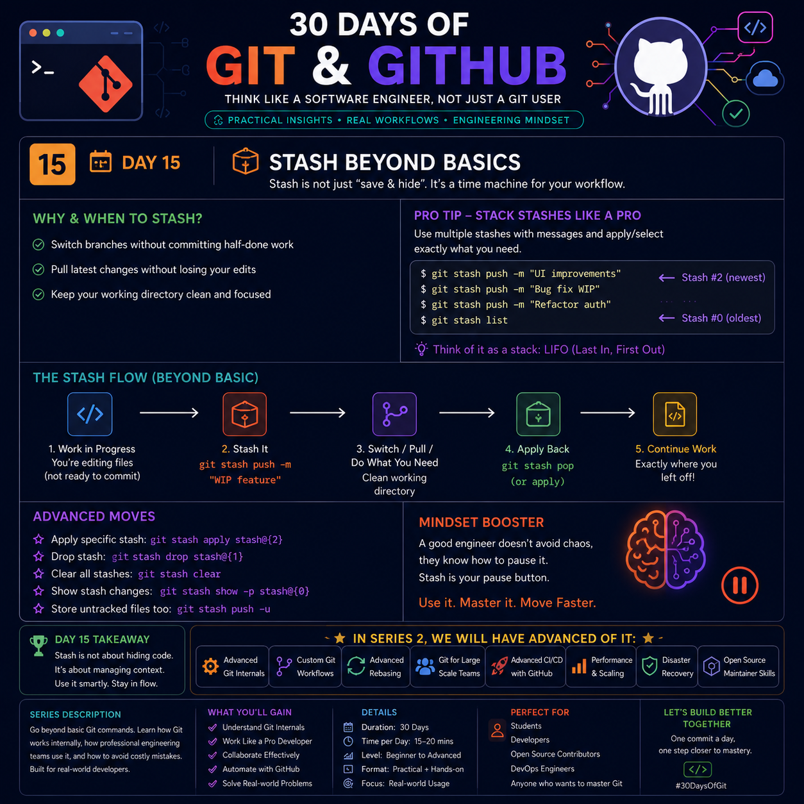

# 🚀 Day 15 — Stash Beyond Basics

> **"Git Stash isn't just a place to hide changes—it's a tool for managing your workflow efficiently."**



---

# 📖 What is Git Stash?

Git Stash temporarily saves your **uncommitted changes** so you can work on something else without creating unnecessary commits.

Think of it as a **Pause Button** for your current work.

---

# 🎯 Why Use Git Stash?

Use Git Stash when you need to:

- 🚀 Switch to another branch quickly
- 🐞 Fix an urgent production bug
- 🔄 Pull the latest changes safely
- 🧪 Test your project in a clean state
- 💡 Pause an unfinished feature

---

# 🛠 Basic Commands

## Save Changes

```bash
git stash
```

---

## Save with a Message

```bash
git stash push -m "WIP: Login Page"
```

Adding a message makes it much easier to identify later.

---

## View All Stashes

```bash
git stash list
```

Example:

```text
stash@{0}: WIP: Login Page
stash@{1}: Before API Update
```

---

## Restore Stash

```bash
git stash apply
```

Restores changes **without deleting** the stash.

---

## Restore and Remove

```bash
git stash pop
```

Restores changes **and removes** the stash from the list.

---

## Delete One Stash

```bash
git stash drop stash@{0}
```

---

## Delete All Stashes

```bash
git stash clear
```

---

# 📂 Include Untracked Files

Normally Git only stashes tracked files.

To include newly created files:

```bash
git stash -u
```

---

# 🌿 Create a Branch from a Stash

Instead of restoring on the current branch:

```bash
git stash branch feature-login
```

Git will:

- Create a new branch
- Apply the stash
- Remove the stash automatically (if successful)

---

# ⚡ Pro Tip

Always give meaningful names:

```bash
git stash push -m "Before Payment Refactor"
```

Avoid:

```bash
git stash
git stash
git stash
```

You'll quickly forget what each stash contains.

---

# 🧠 Engineer's Workflow

```text
Work on Feature
      │
      ▼
git stash push -m "WIP"
      │
      ▼
Switch Branch
      │
      ▼
Complete Urgent Task
      │
      ▼
Return to Feature Branch
      │
      ▼
git stash pop
      │
      ▼
Continue Development
```

---

# 💡 Best Practices

✅ Use meaningful stash messages.

✅ Use `git stash apply` when you want extra safety.

✅ Include untracked files using `-u` when necessary.

✅ Don't keep old stashes for weeks.

✅ Convert important work into a branch instead of relying on stash forever.

---

# ❌ Common Mistakes

❌ Using stash as permanent backup.

❌ Forgetting untracked files.

❌ Creating anonymous stashes.

❌ Running `git stash clear` without checking the stash list.

---

# 🏆 Quick Cheat Sheet

| Command | Purpose |
|---------|----------|
| `git stash` | Save current changes |
| `git stash push -m "msg"` | Save with message |
| `git stash list` | View stashes |
| `git stash apply` | Restore without deleting |
| `git stash pop` | Restore and delete |
| `git stash drop` | Delete one stash |
| `git stash clear` | Delete all stashes |
| `git stash -u` | Include untracked files |
| `git stash branch <name>` | Create branch from stash |

---

# 🎯 Key Takeaway

> **Git Stash isn't for hiding code—it's for managing context.**

Great developers don't use it to avoid commits.

They use it to **switch tasks quickly, keep history clean, and stay productive.**

---

⭐ **Day 15 Complete!**

**Next:** Day 16 — Tags & Releases 🚀