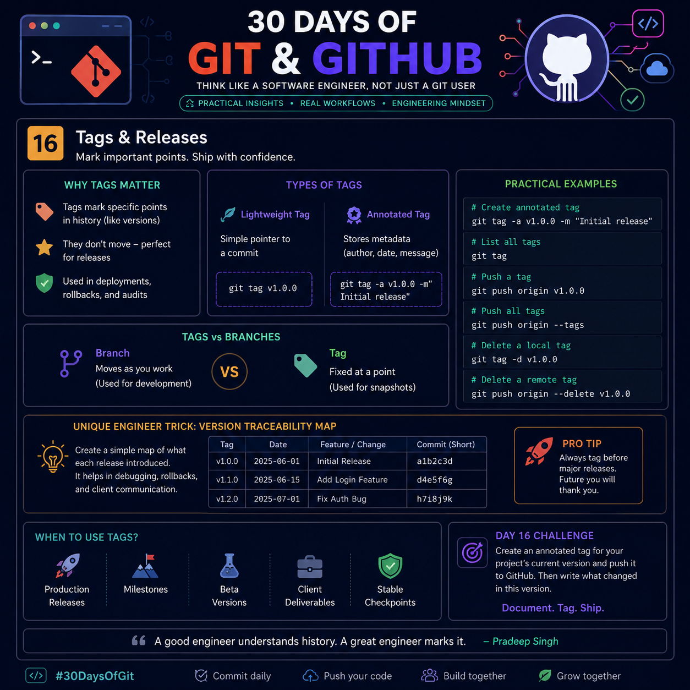

# 🏷️ Day 16 — Git Tags & Releases



> **"Commits tell the story. Tags highlight the milestones."**

Git Tags are permanent references to specific commits. They are commonly used to mark **software versions**, **production releases**, and **important project milestones**. Unlike branches, tags do not move when new commits are added, making them ideal for creating stable checkpoints in your project's history.

---

# 🎯 Why Tags Matter

Imagine you're building an application.

```
Commit A → Commit B → Commit C → Commit D → Commit E
```

After testing Commit C, you release **Version 1.0**.

Instead of remembering the commit hash:

```
3f2ac89...
```

You simply create:

```bash
git tag v1.0.0
```

Now anyone can instantly return to that exact version.

---

# 🧠 Branch vs Tag

| Branch | Tag |
|---------|-----|
| Moves whenever new commits are added | Always points to one specific commit |
| Used during development | Used for releases and milestones |
| Dynamic | Immutable (should not move) |
| Changes every day | Represents a fixed snapshot |

**Simple rule:**

> **Develop on branches. Ship with tags.**

---

# 📌 Types of Git Tags

## 1️⃣ Lightweight Tag

A lightweight tag is simply a name pointing to a commit.

Create one:

```bash
git tag v1.0
```

View tags:

```bash
git tag
```

Best for:

- Temporary checkpoints
- Personal references
- Internal testing

---

## 2️⃣ Annotated Tag ⭐ (Recommended)

Annotated tags store additional metadata.

They include:

- Author
- Email
- Date
- Message

Create one:

```bash
git tag -a v1.0.0 -m "Initial Stable Release"
```

View details:

```bash
git show v1.0.0
```

Professional teams almost always use **annotated tags** for releases.

---

# 🚀 Push Tags to GitHub

Push one tag:

```bash
git push origin v1.0.0
```

Push every local tag:

```bash
git push origin --tags
```

After pushing, GitHub automatically detects the tag and allows you to create a Release.

---

# 🗑️ Delete Tags

Delete local tag:

```bash
git tag -d v1.0.0
```

Delete remote tag:

```bash
git push origin --delete v1.0.0
```

---

# 📦 What is a GitHub Release?

A Release is built on top of a Git Tag.

It usually contains:

- Version number
- Release notes
- Bug fixes
- New features
- Downloadable binaries
- Source code snapshots

Think of it like this:

```
Commit
   ↓
Tag
   ↓
GitHub Release
```

A **tag** identifies the version, while a **release** documents and distributes it.

---

# 💡 Engineer Trick — Version Traceability Map

Most developers create a tag and move on.

A better engineering practice is to maintain a simple release map alongside your project.

| Version | Release Date | Features | Commit |
|----------|--------------|----------|--------|
| v1.0.0 | 2026-07-01 | Initial Release | a1b2c3 |
| v1.1.0 | 2026-07-10 | Login System | d4e5f6 |
| v1.2.0 | 2026-07-14 | Security Fixes | h7i8j9 |

### Why this helps

- Easier debugging
- Faster rollback decisions
- Better client communication
- Clear project history
- Useful during audits
- Simplifies onboarding for new developers

This is a simple engineering habit that scales well as projects grow.

---

# 🛠️ Real Development Workflow

```text
Develop Feature
      │
      ▼
Test Thoroughly
      │
      ▼
Merge into Main
      │
      ▼
Create Annotated Tag
      │
      ▼
Push Tag
      │
      ▼
Create GitHub Release
      │
      ▼
Deploy to Production
```

---

# 📍 When Should You Create Tags?

Create tags for:

- Stable releases
- Production deployments
- Beta versions
- Client deliveries
- Major milestones
- Long-term support (LTS) versions
- Hotfix releases

Avoid tagging every small commit. Tags should represent meaningful checkpoints.

---

# ⚡ Best Practices

✅ Use semantic versioning (`v1.0.0`, `v1.2.3`)

✅ Prefer annotated tags for releases.

✅ Push tags immediately after creating them.

✅ Write meaningful release notes.

✅ Keep version names consistent.

✅ Never rename published release tags.

---

# ❌ Common Mistakes

- Using lightweight tags for production releases
- Forgetting to push tags to the remote repository
- Creating tags before testing
- Using inconsistent version names
- Moving or deleting release tags after publishing

---

# 🎯 Day 16 Challenge

Complete the following:

1. Create an annotated tag:

```bash
git tag -a v1.0.0 -m "Initial Release"
```

2. Push it:

```bash
git push origin v1.0.0
```

3. Open GitHub and create a Release.

4. Write release notes including:

- New features
- Bug fixes
- Improvements
- Known issues

5. Add the release to your project's documentation.

---

# 🧠 Key Takeaways

- A **Tag** is a permanent pointer to a specific commit.
- A **Release** is a documented, shareable version built from a tag.
- Branches move; tags stay fixed.
- Use **annotated tags** for professional software releases.
- Maintaining a version history improves collaboration, debugging, and deployment confidence.

---

> **"Branches help you build the future. Tags preserve the moments worth remembering."** 🚀