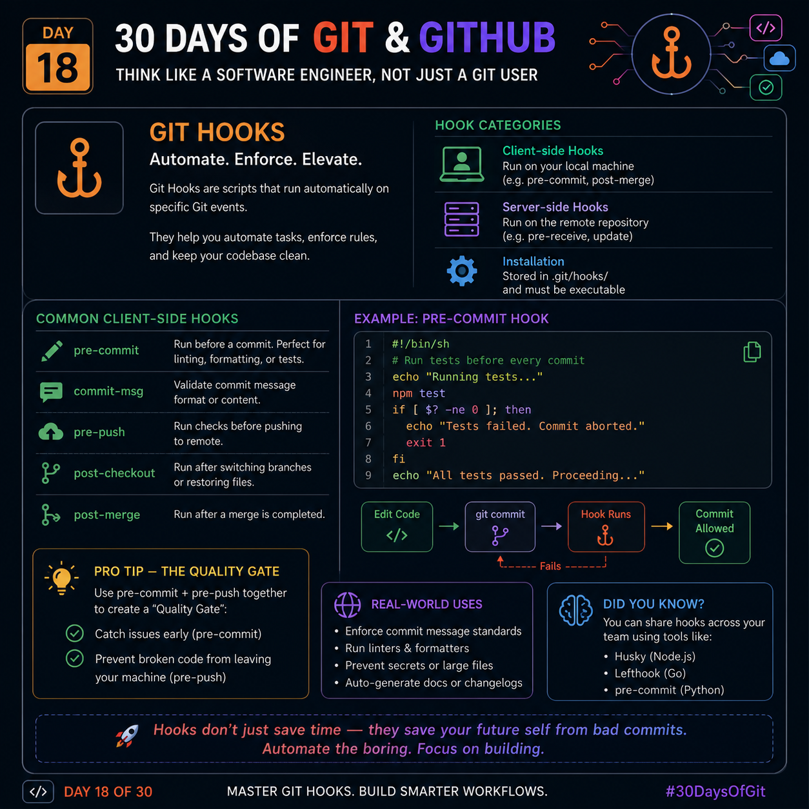

# 🚀 Day 18 – Git Hooks

> **Automate repetitive work. Prevent mistakes before they happen.**

Git Hooks are small scripts that Git automatically runs whenever a specific event occurs (like committing, merging, or pushing code). They help automate tasks, enforce coding standards, and improve code quality.

---

# 🧠 What are Git Hooks?

Think of Git Hooks as **automatic checkpoints**.

Instead of remembering to run tests or format code manually, Git can do it for you.

**Example:**
- Before every commit → Run formatter
- Before every push → Run tests
- After merge → Install new dependencies automatically

This makes development faster and reduces human errors.

---

# 📂 Types of Git Hooks

## 1️⃣ Client-side Hooks
Run on your own computer.

Common examples:

- `pre-commit`
- `commit-msg`
- `pre-push`
- `post-checkout`
- `post-merge`

These are mainly used for improving developer productivity.

---

## 2️⃣ Server-side Hooks

Run on the Git server.

Examples:

- pre-receive
- update
- post-receive

Used by organizations to enforce repository rules before accepting code.

---

# ⭐ Most Useful Client-side Hooks

## 🔹 pre-commit

Runs before Git creates a commit.

Common uses:

- Format code
- Run linter
- Run unit tests
- Detect secrets
- Check file size

If any check fails, Git cancels the commit.

---

## 🔹 commit-msg

Runs after writing the commit message.

Use it to ensure every commit follows a standard.

Example:

✅ feat: Add login API

❌ Updated stuff

Consistent commit messages make project history much easier to understand.

---

## 🔹 pre-push

Runs before pushing code to GitHub.

Perfect for:

- Running full test suite
- Security scanning
- Build verification

If something breaks, Git stops the push.

---

## 🔹 post-checkout

Runs whenever you switch branches.

Useful for:

- Generating configuration files
- Restoring environment settings
- Installing branch-specific dependencies

Everything stays ready automatically.

---

## 🔹 post-merge

Runs immediately after merging.

Common tasks:

- Install new packages
- Update generated files
- Refresh caches

No manual setup required.

---

# 💡 The Quality Gate Trick

A powerful workflow is using **pre-commit + pre-push** together.

### Before Commit
✔ Format code

✔ Remove trailing spaces

✔ Run linter

✔ Detect secrets

---

### Before Push

✔ Run tests

✔ Verify build

✔ Check security

Only clean and verified code reaches GitHub.

This creates a simple **Quality Gate** for every developer.

---

# 🌍 Real-world Uses

Professional engineering teams use Git Hooks to:

- Automatically format code
- Enforce commit message rules
- Prevent API keys from being committed
- Run tests before pushing
- Generate documentation
- Keep repositories clean

This saves time and avoids many common mistakes.

---

# 💎 Popular Hook Managers

Managing Git Hooks manually becomes difficult in large projects.

Popular tools include:

- **Husky** → JavaScript / Node.js
- **pre-commit** → Python
- **Lefthook** → Go (very fast)

These tools help teams share the same hook configuration.

---

# 🔥 Key Takeaway

Git Hooks don't make Git faster.

They make **developers more reliable**.

By automating repetitive checks, you reduce bugs, improve consistency, and spend more time building features instead of fixing preventable mistakes.

> **Great developers don't rely on memory—they automate quality.** 🚀