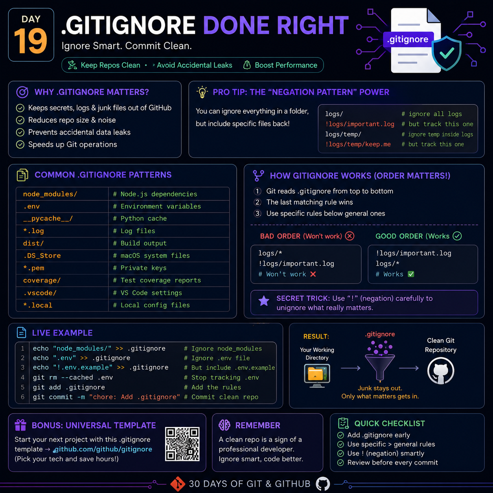

# Day 19 — `.gitignore` Done Right



> **Ignore Smart. Commit Clean.**

A `.gitignore` file tells Git which files and folders should **not** be tracked or committed. It keeps your repository clean, secure, and professional by excluding temporary, generated, and sensitive files.

---

# 🎯 Why `.gitignore` Matters

A good `.gitignore` helps you:

- 🔒 Prevent accidental exposure of secrets
- 📦 Reduce repository size
- 🚀 Improve Git performance
- 🧹 Keep commits clean
- 👥 Avoid machine-specific files
- ✅ Make repositories easier to maintain

---

# 📁 Common `.gitignore` Rules

```gitignore
# Dependencies
node_modules/

# Environment Variables
.env

# Python Cache
__pycache__/

# Log Files
*.log

# Build Folder
dist/

# macOS Files
.DS_Store

# Private Keys
*.pem

# Coverage Reports
coverage/

# VS Code
.vscode/

# Local Configuration
*.local
```

---

# 🧠 Understand the Patterns

## Ignore an entire folder

```gitignore
node_modules/
```

Everything inside the folder is ignored.

---

## Ignore by file extension

```gitignore
*.log
```

Examples:

```
server.log
error.log
debug.log
```

---

## Ignore one file

```gitignore
.env
```

Only the `.env` file is ignored.

---

# ⭐ Pro Tip — The Negation Pattern (`!`)

You can ignore an entire folder but still keep important files inside it.

```gitignore
logs/
!logs/important.log
```

Meaning:

- Ignore everything inside `logs/`
- Continue tracking `important.log`

Another practical example:

```gitignore
.env
!.env.example
```

Keep secrets private while sharing a safe template.

---

# ⚠ Rule Order Matters

Git processes `.gitignore` from **top to bottom**.

General rules should come **before** exceptions.

### ❌ Bad

```gitignore
!logs/important.log
logs/*
```

### ✅ Good

```gitignore
logs/*
!logs/important.log
```

> Always write broad ignore rules first, then exceptions.

---

# 🚨 Important Limitation

`.gitignore` only works for **untracked files**.

If a file has already been committed, Git will continue tracking it.

Stop tracking it with:

```bash
git rm --cached .env
git commit -m "Stop tracking .env"
```

For folders:

```bash
git rm -r --cached node_modules
```

---

# 💻 Live Example

```bash
echo "node_modules/" >> .gitignore
echo ".env" >> .gitignore
echo "!.env.example" >> .gitignore

git rm --cached .env

git add .gitignore

git commit -m "Configure .gitignore"
```

---

# 🔍 Debug Ignored Files

Check why Git ignores a file:

```bash
git check-ignore -v .env
```

Git will show the exact rule responsible.

---

# ⚡ Hidden Engineering Insight

Most developers use `.gitignore` only to **ignore files**.

Professional teams use it to **define repository boundaries**.

Ask yourself:

> **"Should this file exist in every developer's machine?"**

- ✅ Yes → Track it
- ❌ No → Ignore it

This simple mindset prevents repository clutter and accidental commits.

---

# ✅ Quick Checklist

Before every commit:

- [ ] `.gitignore` created
- [ ] Secrets ignored (`.env`, API keys)
- [ ] Dependencies ignored
- [ ] Build outputs ignored
- [ ] Cache files ignored
- [ ] Logs ignored
- [ ] Temporary files ignored
- [ ] Checked `git status`
- [ ] Removed already tracked sensitive files

---

# 💡 Best Practices

- Create `.gitignore` before the first commit.
- Never commit passwords, tokens, or private keys.
- Commit `.env.example`, never `.env`.
- Review ignored files periodically.
- Use language-specific `.gitignore` templates for new projects.
- Always verify with:

```bash
git status
```

---

# 🚀 Key Takeaway

A great developer doesn't just write clean code.

They maintain a **clean repository**.

```
Track source code.
Ignore generated files.
Protect sensitive information.
Commit only what matters.
```

---

## 📌 Remember

> **A clean Git repository reflects a disciplined engineer.**

Small improvements in repository hygiene save countless hours for every contributor throughout the project's lifetime.

---

**Day 19/30 — 30 Days of Git & GitHub**

**#Git #GitHub #GitIgnore #SoftwareEngineering #OpenSource #DeveloperTools**