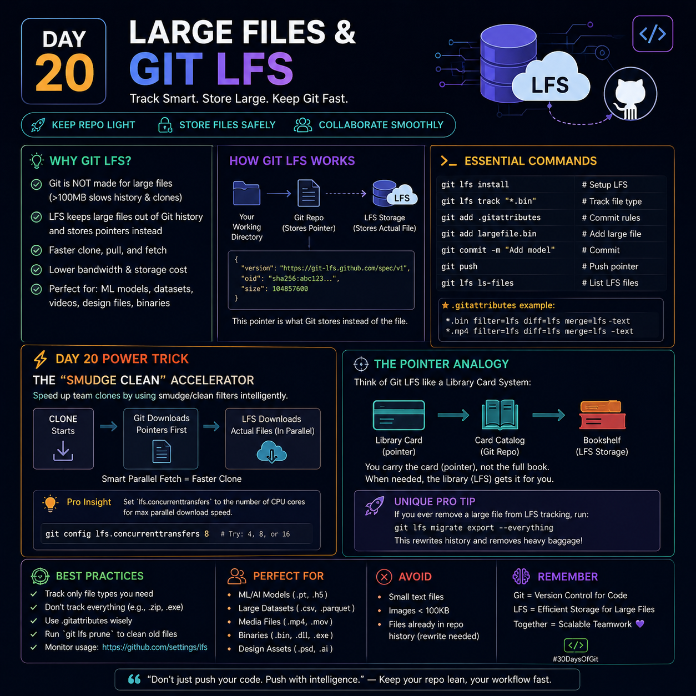

# 🚀 Day 20 – Large Files & Git LFS



> **Track Smart. Store Large. Keep Git Fast.**

---

# 🎯 Why Git LFS?

Git is designed for **source code**, not huge binary files.

Without Git LFS:

- ❌ Every version of a large file is stored forever.
- ❌ Repository size grows rapidly.
- ❌ Clone, Fetch, and Pull become slow.
- ❌ Team productivity decreases.

Git LFS solves this by storing **only a small pointer inside Git** while the actual file is stored separately.

---

# ⚙️ How Git LFS Works

```
Working Directory
       │
       ▼
Git Repository
(Stores Pointer File)
       │
       ▼
Git LFS Server
(Stores Real File)
```

Git history contains:

```
version https://git-lfs.github.com/spec/v1
oid sha256:xxxxxxxxxxxxxxxx
size 248563712
```

Instead of storing:

```
movie.mp4 (2GB)
```

Git stores:

```
Pointer → movie.mp4
```

---

# 📌 Essential Commands

Install Git LFS

```bash
git lfs install
```

Track file type

```bash
git lfs track "*.psd"
```

Track videos

```bash
git lfs track "*.mp4"
```

Track ML models

```bash
git lfs track "*.pt"
```

Commit attributes

```bash
git add .gitattributes
```

Commit files

```bash
git add .
git commit -m "Add large files"
```

Push

```bash
git push origin main
```

List tracked files

```bash
git lfs ls-files
```

---

# 📄 Example `.gitattributes`

```text
*.psd filter=lfs diff=lfs merge=lfs -text
*.mp4 filter=lfs diff=lfs merge=lfs -text
*.pt filter=lfs diff=lfs merge=lfs -text
*.zip filter=lfs diff=lfs merge=lfs -text
```

---

# 💡 Pointer Analogy

Think of Git LFS like a **Library**.

```
Git Repository
      │
      ▼
Library Card
      │
      ▼
Library Storage
```

You carry only the **library card (pointer)**.

When needed, Git LFS fetches the actual file.

---

# ⚡ Day 20 Power Trick

## Clone Faster with LFS

Normal Git:

```
Clone
 ↓
Download every large file
 ↓
Repository Ready
```

Git LFS:

```
Clone
 ↓
Download lightweight pointers
 ↓
Download only required files
 ↓
Repository Ready Faster
```

Result:

- Faster clone
- Lower bandwidth
- Better scalability

---

# 🧠 Pro Tip

Increase parallel downloads.

```bash
git config lfs.concurrenttransfers 8
```

Recommended values

```
4
8
16
```

Use according to your CPU and network speed.

---

# ⭐ Best Practices

- Track only required large file types.
- Commit `.gitattributes`.
- Store source code in Git.
- Store binaries in Git LFS.
- Clean unused LFS files regularly.

---

# 🎯 Perfect For

- Machine Learning Models
- Large Datasets
- Videos
- PSD Files
- Figma Exports
- CAD Files
- Audio Files
- Game Assets
- Large Documents

---

# ❌ Avoid Git LFS For

- Small text files
- README.md
- HTML
- CSS
- JavaScript
- JSON
- YAML
- Configuration files

These already compress well inside Git.

---

# 🧩 Unique Engineering Insight

## Track Stable Artifacts, Not Temporary Builds

A useful rule for engineering teams:

If a file can be **recreated automatically** (e.g., `dist/`, `build/`, compiled binaries), **don't store it in Git or Git LFS**.

If a file is **valuable and difficult to reproduce** (e.g., trained ML models, licensed design assets, raw media), Git LFS is a good fit.

This keeps repositories lean while preserving important artifacts.

---

# 🧠 Remember

```
Git
=
Version Control

Git LFS
=
Large File Storage

Git
stores pointers

Git LFS
stores actual large files
```

---

> **"Don't make Git carry heavy files—let Git version your code, and let Git LFS handle the weight."**