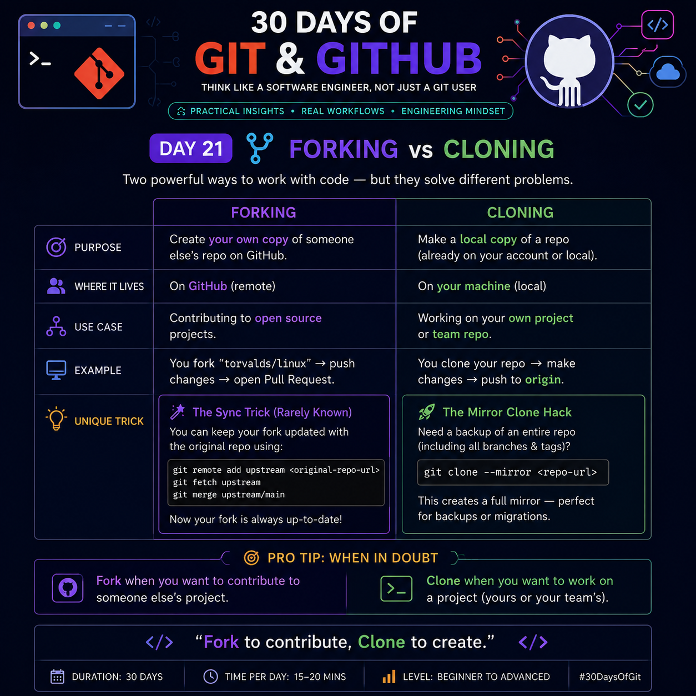

# Day 21: Forking vs Cloning



## 🚀 What You'll Learn
Many developers use **Fork** and **Clone** interchangeably, but they solve **completely different problems**.

- **Fork** → Create your own copy of someone else's repository on GitHub.
- **Clone** → Download a repository to your local machine.

Understanding when to use each is essential for professional Git workflows.

---

# Forking

## What is a Fork?

A **Fork** creates a new repository under **your GitHub account**.

The original repository remains unchanged.

```
Original Repository
        │
      Fork
        │
 Your GitHub Repository
```

### Why use Fork?

- Contribute to Open Source
- You don't have write access
- Experiment safely
- Maintain your own version

---

## Example Workflow

```
Original Repo
      │
      ▼
Fork Repository
      │
      ▼
Clone Your Fork
      │
      ▼
Make Changes
      │
      ▼
Push Changes
      │
      ▼
Create Pull Request
```

---

# Cloning

## What is Clone?

Clone copies a repository from GitHub to your local machine.

```
GitHub Repository
        │
        ▼
Your Computer
```

You now have a full working copy.

---

## Why use Clone?

- Start development
- Work on company repositories
- Build projects locally
- Test applications

---

## Example Workflow

```
GitHub Repository
        │
        ▼
git clone <repo-url>
        │
        ▼
Local Development
        │
        ▼
Commit
        │
        ▼
Push
```

---

# Fork vs Clone

| Feature | Fork | Clone |
|---------|------|--------|
| Creates New GitHub Repository | ✅ Yes | ❌ No |
| Creates Local Copy | ❌ No | ✅ Yes |
| Used for Open Source | ✅ Yes | Sometimes |
| Used for Team Projects | Rarely | ✅ Yes |
| Requires GitHub | ✅ Yes | Repository can be local or remote |

---

# Real-Life Example

Imagine a public GitHub project.

### If you want to contribute:

```
Fork
 ↓
Clone Your Fork
 ↓
Make Changes
 ↓
Push
 ↓
Open Pull Request
```

---

### If it's your own project:

```
Clone Repository
 ↓
Code
 ↓
Commit
 ↓
Push
```

No fork required.

---

# 💡 Pro Trick 1 — Keep Your Fork Updated

Many developers repeatedly download a fresh fork.

A better approach is to connect your fork with the original repository using an **upstream** remote.

```bash
git remote add upstream <original-repository-url>
git fetch upstream
git merge upstream/main
```

Now your fork stays synchronized with the original project.

> This is especially useful before creating a Pull Request.

---

# 💡 Pro Trick 2 — Mirror Clone

Need an exact backup of an entire repository?

Use:

```bash
git clone --mirror <repository-url>
```

Unlike a normal clone, this also copies:

- All branches
- All tags
- Remote references
- Git metadata

Useful for:

- Repository migration
- Internal backups
- Server-to-server replication

---

# Common Mistakes

❌ Forking your own repository unnecessarily.

❌ Creating Pull Requests directly from the original repository.

❌ Forgetting to update your fork before starting new work.

❌ Thinking Fork automatically downloads code to your computer.

---

# Interview Questions

### Q1. Difference between Fork and Clone?

**Answer:**

- Fork creates a new repository on GitHub.
- Clone creates a local copy on your machine.

---

### Q2. Can you clone without forking?

✅ Yes.

If you have access to a repository, you can clone it directly.

---

### Q3. Do you always need a fork?

❌ No.

Forks are mainly used when you **don't have write access**, such as contributing to open-source projects.

---

### Q4. Can I push after cloning?

✅ Yes.

If you have write permission.

Otherwise Git will reject the push.

---

# Best Practice

### Use **Fork** when:

- Contributing to open source
- You don't have repository write access
- You want your own independent GitHub copy

### Use **Clone** when:

- Working on your own repository
- Collaborating within a team
- Developing locally

---

# Quick Decision Flow

```text
Want to contribute to someone else's public repository?
                │
         ┌──────┴──────┐
         │             │
        Yes           No
         │             │
      Fork Repo     Clone Repo
         │             │
      Clone Fork    Start Coding
         │
     Make Changes
         │
   Open Pull Request
```

---

# Cheat Sheet

| Need | Use |
|------|-----|
| My own local copy | Clone |
| Open-source contribution | Fork |
| Company project | Clone |
| Independent GitHub copy | Fork |
| Repository backup | Mirror Clone |

---

# Remember

> **Fork to contribute. Clone to develop.**