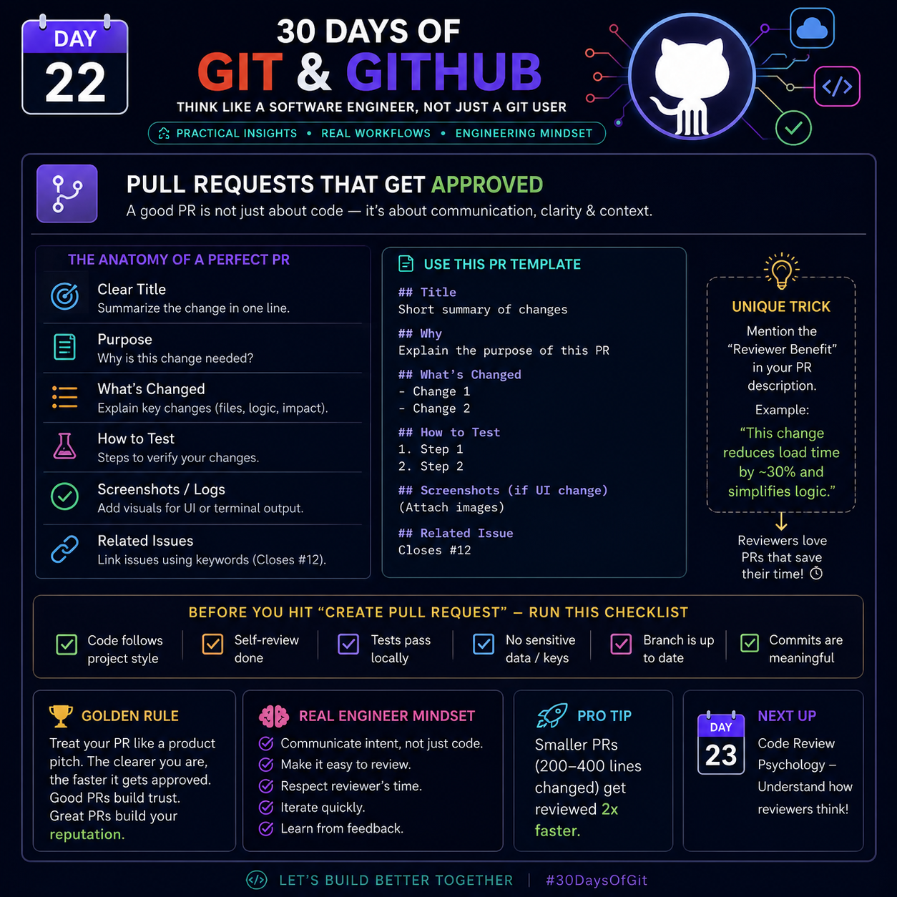

# Day 22 — Pull Requests That Get Approved



> **A good Pull Request (PR) is not just about code — it's about communication, clarity, and context.**

---

# 🎯 Why Pull Requests Matter

A Pull Request is your opportunity to explain **what changed, why it changed, and how reviewers can verify it**.

Good PRs:

- Reduce review time
- Prevent misunderstandings
- Improve code quality
- Build trust with teammates

---

# 🧩 Anatomy of a Perfect Pull Request

## 1. Clear Title

A reviewer should understand the purpose in one sentence.

### ❌ Bad

```
Update code
```

### ✅ Good

```
Fix JWT token expiration issue during login
```

---

## 2. Purpose

Explain **why** this change was required.

Example:

> Users were being logged out after 5 minutes because the refresh token was not renewed.

---

## 3. What's Changed

Summarize the important changes.

Example:

- Added refresh token validation
- Updated authentication middleware
- Improved error handling

---

## 4. How to Test

Tell reviewers exactly how to verify.

Example:

1. Login
2. Wait 10 minutes
3. Refresh page
4. User should remain logged in

---

## 5. Screenshots / Logs

If UI changed:

- Before
- After

If backend changed:

- API response
- Terminal logs

Visual proof speeds up reviews.

---

## 6. Related Issues

Link GitHub issues.

Example

```
Closes #12
Fixes #35
Resolves #78
```

GitHub automatically closes them after merge.

---

# 📄 Simple Pull Request Template

```md
## Title

Short summary

## Why

Why is this change needed?

## What's Changed

- Change 1
- Change 2

## How to Test

1. Step 1
2. Step 2

## Screenshots

(Attach if UI changed)

## Related Issue

Closes #12
```

---

# 💡 Unique Trick — "Reviewer Benefit"

Instead of only explaining **what you changed**, explain:

> **How this helps the reviewer or the product.**

Example:

```
This optimization reduces loading time by around 30%
and removes duplicate API calls.
```

This gives reviewers immediate context about the value of the change.

---

# ✅ Pull Request Checklist

Before clicking **Create Pull Request**, verify:

- [ ] Code follows project style
- [ ] Self-review completed
- [ ] Tests pass locally
- [ ] No API keys or secrets committed
- [ ] Branch is up to date
- [ ] Commit messages are meaningful

---

# 🏆 Golden Rule

Think of your Pull Request like a product pitch.

A reviewer should understand:

- What changed
- Why it changed
- How to test it

without asking extra questions.

Clear PRs get approved faster.

---

# 🧠 Real Engineer Mindset

Professional developers:

- Communicate intent, not just code
- Make reviews easy
- Respect reviewer time
- Iterate quickly after feedback
- Learn from every review

---

# 🚀 Pro Tip

Large Pull Requests are harder to review.

Aim for:

- One feature
- One bug fix
- One improvement

Smaller PRs (around **200–400 changed lines**) are generally easier to review, discuss, and merge than very large changes.

---

# ⚡ Key Takeaways

- A PR is documentation for your code.
- Explain the **why**, not just the **what**.
- Provide testing steps.
- Include screenshots when applicable.
- Link related issues.
- Keep PRs focused and reasonably small.
- Make reviewers' work easy.

---

## Next Day

**Day 23 — Code Review Psychology**

Learn how experienced reviewers think, what they look for first, and how to receive feedback like a professional engineer.