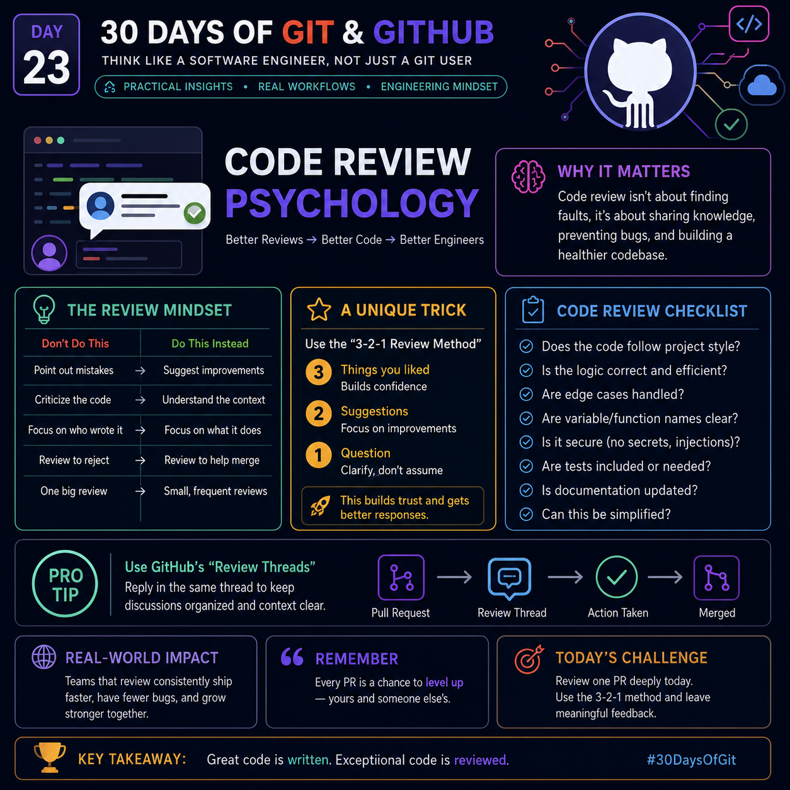

# Day 23 – Code Review Psychology


> **Goal:** Learn how experienced engineers think during code reviews. A great review is not about proving someone wrong—it is about improving the codebase together.

---

# 🧠 Why Code Review Matters

Code review is a collaborative engineering process that helps teams:

- Catch bugs before production
- Improve code quality
- Share knowledge across the team
- Maintain coding standards
- Build a healthier and more maintainable codebase

> **Mindset:** Review the **code**, never the **person**.

---

# 💡 The Review Mindset

| ❌ Don't Do This | ✅ Do This Instead |
|-----------------|-------------------|
| Point out mistakes | Suggest improvements |
| Criticize the developer | Understand the context |
| Focus on who wrote it | Focus on what it does |
| Review to reject | Review to help merge |
| Leave one huge review | Give small, frequent reviews |

---

# ⭐ The 3–2–1 Review Method

A simple framework for giving constructive reviews.

## 3 Things You Liked

Start with positive observations.

Example:

- Clean function structure
- Meaningful variable names
- Good test coverage

This builds confidence and encourages good practices.

---

## 2 Suggestions

Offer improvements instead of criticism.

Example:

- Extract duplicated logic into a helper function.
- Handle null values before processing.

Suggestions create learning opportunities.

---

## 1 Question

Ask instead of assuming.

Example:

> Would caching improve performance here?

Questions open discussions instead of arguments.

---

# ✅ Code Review Checklist

Before approving a Pull Request, verify:

- Code follows project style guide
- Logic is correct
- Edge cases are handled
- Variable and function names are meaningful
- No secrets or sensitive information are committed
- Required tests exist or are updated
- Documentation is updated
- Complex code can be simplified

---

# 🚀 Pro Tip

## Keep conversations inside GitHub Review Threads.

Instead of multiple unrelated comments:

```
PR
 ↓
Review Thread
 ↓
Discussion
 ↓
Resolution
 ↓
Merge
```

Benefits:

- Better context
- Easier tracking
- Cleaner conversations
- Faster approvals

---

# 🌍 Real-World Impact

Teams that perform consistent code reviews usually:

- Ship features faster
- Introduce fewer bugs
- Share knowledge naturally
- Reduce technical debt
- Build stronger engineering culture

---

# 🎯 Today's Challenge

Review one Pull Request today.

Apply the **3–2–1 Review Method**:

- 3 Appreciations
- 2 Suggestions
- 1 Question

Notice how the conversation becomes more collaborative and productive.

---

# 🏆 Key Takeaway

> **Great code is written. Exceptional code is reviewed.**

Code reviews are not inspections.

They are conversations that improve:

- Code
- Developers
- Teams
- Products

Master the psychology behind reviews, and you'll become a developer people enjoy collaborating with.