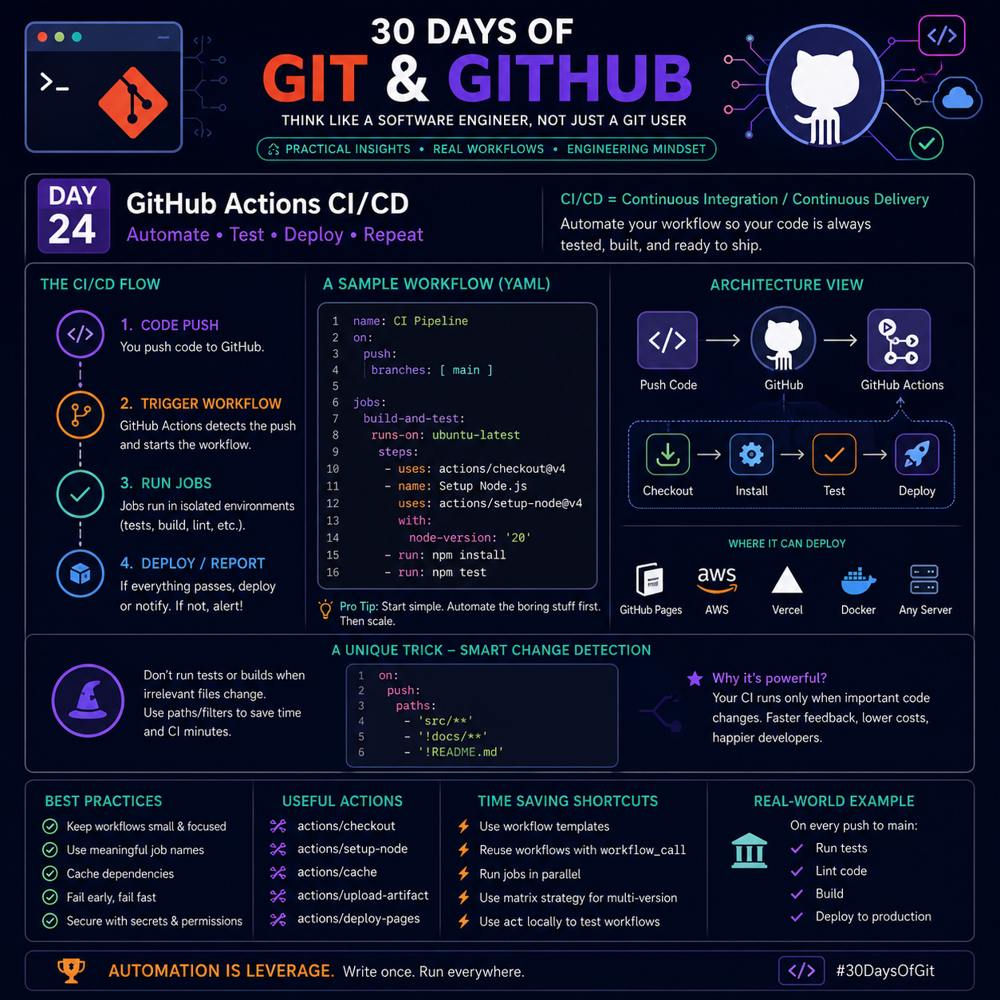

# Day 24 – GitHub Actions CI/CD
> **30 Days of Git & GitHub**


## 🎯 Goal
Learn how to automate testing, building, and deployment using **GitHub Actions**, so every code change is verified before reaching production.

---

# What is GitHub Actions?

GitHub Actions is GitHub's built-in automation platform that allows you to create **CI/CD (Continuous Integration & Continuous Delivery)** pipelines directly inside your repository.

Instead of manually running tests or deployments, GitHub Actions executes them automatically based on events like:

- Push
- Pull Request
- Release
- Schedule
- Manual Trigger
- Issue Creation

Everything is defined using **YAML workflow files**.

---

# What is CI/CD?

## Continuous Integration (CI)

Every code change is automatically:

- Checked out
- Built
- Tested
- Verified

This catches bugs before they reach the main branch.

---

## Continuous Delivery (CD)

After successful testing:

- Build artifacts are created
- Deployment package is prepared
- Deployment becomes ready

---

## Continuous Deployment

The application is automatically deployed without manual intervention.

Example:

```
Push Code
      ↓
Run Tests
      ↓
Build Project
      ↓
Deploy
```

---

# Typical Workflow

```
Developer Pushes Code
          │
          ▼
GitHub Detects Event
          │
          ▼
Workflow Starts
          │
          ▼
Checkout Repository
          │
          ▼
Install Dependencies
          │
          ▼
Run Tests
          │
          ▼
Build Project
          │
          ▼
Deploy
```

---

# Basic Workflow Structure

```yaml
name: CI Pipeline

on:
  push:
    branches:
      - main

jobs:
  build:
    runs-on: ubuntu-latest

    steps:
      - uses: actions/checkout@v4

      - uses: actions/setup-node@v4
        with:
          node-version: 20

      - run: npm install

      - run: npm test
```

---

# Understanding Every Section

## name

Workflow name shown in GitHub.

```yaml
name: CI Pipeline
```

---

## on

Defines when workflow should run.

Example:

```yaml
on:
  push:
```

Other triggers:

```yaml
pull_request:

workflow_dispatch:

schedule:

release:
```

---

## jobs

Each workflow contains one or more jobs.

```yaml
jobs:
```

Jobs run independently.

---

## runs-on

Specifies runner OS.

```yaml
runs-on: ubuntu-latest
```

Other options:

- windows-latest
- macos-latest

---

## steps

Actual commands executed.

Example:

```yaml
steps:
```

Each step performs one task.

---

# Common GitHub Actions

## Checkout Repository

```yaml
uses: actions/checkout@v4
```

Downloads repository code.

---

## Setup Programming Language

Example:

```yaml
uses: actions/setup-node@v4
```

Other setup actions exist for:

- Python
- Java
- Go
- .NET
- Rust

---

## Install Dependencies

```yaml
run: npm install
```

---

## Run Tests

```yaml
run: npm test
```

---

## Build Project

```yaml
run: npm run build
```

---

## Deploy

Example:

```yaml
uses: peaceiris/actions-gh-pages
```

or

```yaml
uses: azure/webapps-deploy
```

depending on your hosting platform.

---

# Where Can You Deploy?

GitHub Actions supports deployment to:

- GitHub Pages
- AWS
- Azure
- Google Cloud
- Docker
- Kubernetes
- Vercel
- Netlify
- DigitalOcean
- Any VPS using SSH

---

# Smart Optimization Trick

## Run workflows only when relevant files change

Instead of running CI for every commit, trigger it only when important files are modified.

Example:

```yaml
on:
  push:
    paths:
      - "src/**"
      - "!docs/**"
      - "!README.md"
```

### Why use this?

- Faster CI
- Lower runner usage
- Reduced costs
- Shorter feedback loop
- Cleaner workflow history

This is especially useful in large repositories where documentation updates don't require rebuilding the project.

---

# Best Practices

- Keep workflows modular.
- Use descriptive job names.
- Cache dependencies for faster builds.
- Fail early when tests fail.
- Store secrets securely using GitHub Secrets.
- Pin action versions (e.g., `@v4`) instead of floating references.
- Reuse workflows with `workflow_call` when multiple repositories share the same pipeline.

---

# Useful GitHub Actions

| Action | Purpose |
|---------|---------|
| actions/checkout | Download repository |
| actions/setup-node | Configure Node.js |
| actions/setup-python | Configure Python |
| actions/cache | Cache dependencies |
| actions/upload-artifact | Store build artifacts |
| actions/download-artifact | Retrieve artifacts |
| actions/deploy-pages | Deploy GitHub Pages |

---

# Time-Saving Tips

- Use reusable workflows.
- Execute independent jobs in parallel.
- Test multiple versions using a matrix strategy.
- Cache package managers.
- Validate workflows locally using `act`.
- Separate CI and CD into independent workflows for easier maintenance.

---

# Real-World Example

Every push to the `main` branch:

- Checkout repository
- Install dependencies
- Run unit tests
- Perform lint checks
- Build application
- Package artifacts
- Deploy automatically if all checks pass

---

# Common Interview Questions

### Q1. What is GitHub Actions?

A workflow automation platform built into GitHub for CI/CD.

---

### Q2. What is a workflow?

A YAML file that defines automated jobs and steps.

---

### Q3. Difference between CI and CD?

- **CI:** Automatically build and test code.
- **CD:** Deliver or deploy verified code automatically or with approval.

---

### Q4. Where are workflow files stored?

```
.github/workflows/
```

---

### Q5. What is a runner?

A virtual machine that executes workflow jobs.

---

# Key Takeaways

- GitHub Actions automates software delivery.
- Workflows are defined using YAML.
- Every workflow consists of events, jobs, and steps.
- CI improves code quality through automatic testing.
- CD speeds up reliable deployments.
- Path filters help optimize execution by skipping unnecessary runs.
- Reusable workflows and caching significantly improve maintainability and performance.

---

> **Automation is leverage.**  
> Write the workflow once, and let GitHub handle repetitive tasks so you can focus on building great software.