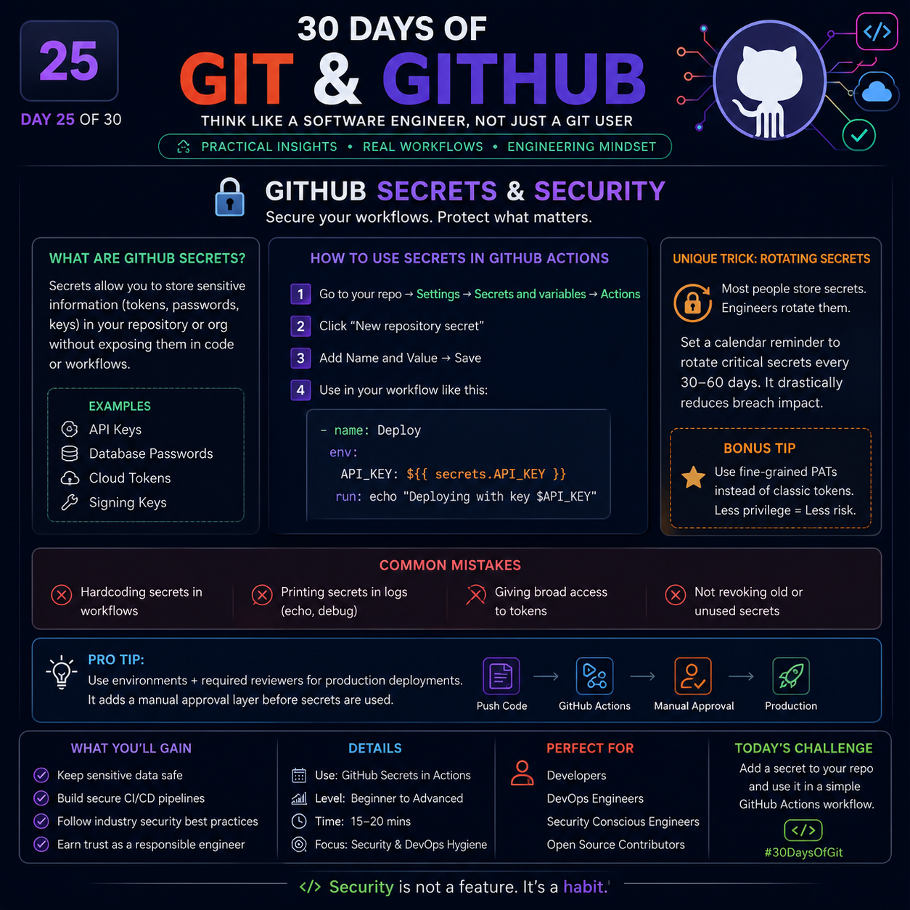

# Day 25 – GitHub Secrets & Security 🔐


> **"Security is not something you add later—it is something you design from the very first commit."**

GitHub Secrets help you store sensitive information safely so your credentials never appear in your source code or commit history.

---

# 🎯 What You'll Learn

- Why GitHub Secrets are important
- How to securely use secrets in GitHub Actions
- Common security mistakes developers make
- Professional security practices followed by engineering teams
- A practical workflow for secure CI/CD

---

# 🤔 What are GitHub Secrets?

GitHub Secrets are encrypted values stored securely inside your repository, organization, or environment.

Instead of writing sensitive information directly into your project, GitHub injects them only when your workflow executes.

Examples include:

- API Keys
- Database Passwords
- AWS Credentials
- Azure Credentials
- Docker Hub Tokens
- SSH Keys
- JWT Signing Keys
- Firebase Keys
- Stripe Secret Keys
- OpenAI API Keys

---

# ❌ Never Do This

```python
API_KEY = "sk-123456789abcdef"
```

Even if the repository becomes private later...

Git history **still remembers it.**

Removing it from the latest commit does **NOT** completely remove it from history.

---

# ✅ Correct Way

Store the secret inside GitHub.

```
Repository
    ↓
Settings
    ↓
Secrets and variables
    ↓
Actions
    ↓
New repository secret
```

Example

Name

```
API_KEY
```

Value

```
sk-xxxxxxxxxxxxxxxxxxxx
```

---

# 🚀 Using Secrets in GitHub Actions

```yaml
name: Deploy

on:
  push:
    branches:
      - main

jobs:
  deploy:
    runs-on: ubuntu-latest

    env:
      API_KEY: ${{ secrets.API_KEY }}

    steps:
      - uses: actions/checkout@v4

      - name: Deploy
        run: python deploy.py
```

GitHub automatically injects the secret during execution.

It is **never stored** in your repository.

---

# 🧠 Secret Scope

GitHub supports different security scopes.

## Repository Secrets

Only available to one repository.

Best for:

- Personal projects
- Individual applications

---

## Organization Secrets

Shared across multiple repositories.

Best for:

- Company projects
- Shared infrastructure
- Multiple teams

---

## Environment Secrets

Used only in specific environments.

Examples

```
Development

Testing

Production
```

This prevents production credentials from being used accidentally.

---

# 🔥 Professional Security Flow

```
Developer
      │
      ▼
Push Code
      │
      ▼
GitHub Actions
      │
      ▼
Read Secret
      │
      ▼
Deploy Application
      │
      ▼
Secret Disappears
```

Secrets only exist while the workflow is running.

---

# ⚠️ Common Mistakes

## ❌ Hardcoding Secrets

```python
PASSWORD = "admin123"
```

---

## ❌ Printing Secrets

```yaml
echo $API_KEY
```

Even masked values can accidentally leak context.

---

## ❌ Giving Everyone Access

Only authorized workflows should use production secrets.

Follow the **Principle of Least Privilege**.

---

## ❌ Never Rotating Secrets

Using the same credentials for years increases security risk.

---

## ❌ Reusing the Same Secret Everywhere

Use different credentials for:

- Development
- Testing
- Production

If one leaks, the others remain secure.

---

# 💡 Valuable Engineering Tip

Instead of creating one "MASTER_API_KEY"

Create purpose-specific secrets.

Example

```
PAYMENT_API_KEY

EMAIL_API_KEY

DATABASE_PASSWORD

AWS_DEPLOY_KEY
```

Smaller permissions mean smaller damage if compromised.

This follows the **Principle of Least Privilege**, a widely accepted security best practice.

---

# ⭐ Advanced Tip

Protect production environments using:

- Required reviewers
- Deployment approvals
- Environment protection rules

This means:

```
Push Code
      ↓
Workflow Starts
      ↓
Manual Approval
      ↓
Secrets Become Available
      ↓
Production Deployment
```

Even if someone pushes malicious code, deployment cannot proceed without approval.

---

# 🔄 Secret Rotation Strategy

A practical schedule used by many engineering teams:

| Secret Type | Suggested Rotation |
|-------------|-------------------|
| API Keys | Every 30–90 days |
| Database Passwords | Every 60–90 days |
| Cloud Credentials | Every 60 days |
| Personal Access Tokens | Rotate before expiry |
| Temporary Credentials | Use short-lived tokens whenever possible |

The exact interval depends on your organization's security policies and compliance requirements.

---

# 🛡️ Security Checklist

- Store secrets only in GitHub Secrets
- Never commit credentials
- Never expose secrets in logs
- Use environment-specific secrets
- Rotate secrets regularly
- Remove unused secrets
- Use least privilege access
- Protect production deployments
- Audit secrets periodically

---

# 🚀 Real-World Workflow

```
Developer
     │
     ▼
Push Code
     │
     ▼
GitHub Actions
     │
     ▼
Read Encrypted Secrets
     │
     ▼
Build
     │
     ▼
Test
     │
     ▼
Deploy
     │
     ▼
Production
```

---

# 🎯 Challenge

Create your first GitHub Secret.

Store:

```
DEMO_API_KEY
```

Then create a GitHub Actions workflow that securely reads it without exposing the value in your repository.

---

# 💎 Key Takeaways

- Secrets should never be stored in source code.
- GitHub Secrets provide encrypted storage for sensitive values.
- Use repository, organization, or environment secrets based on your project needs.
- Protect production deployments with approvals and environment protection.
- Rotate credentials regularly and follow the Principle of Least Privilege.

---

> **"A secure repository isn't the one without secrets—it's the one where secrets are managed safely."** 🔐