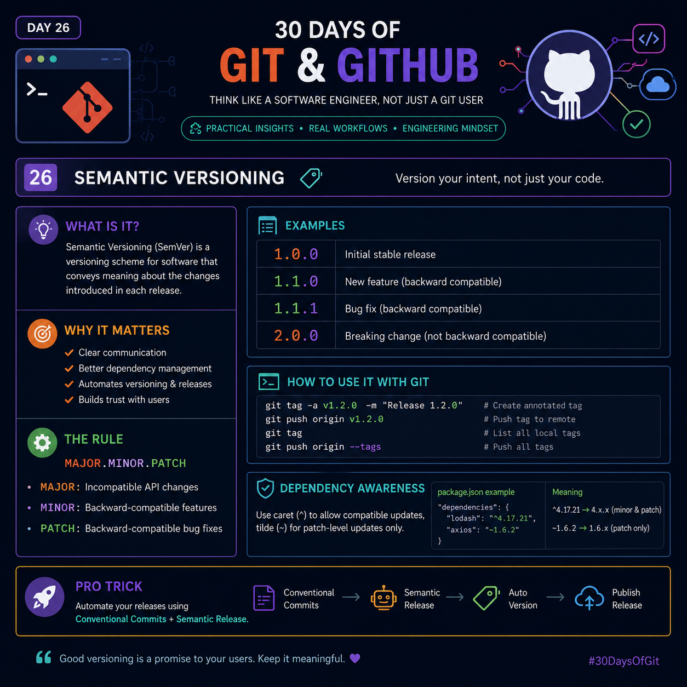

# Day 26 — Semantic Versioning (SemVer)



> **Version your intent, not just your code.**

Semantic Versioning (SemVer) is a standard versioning system that communicates the impact of changes in every software release. Instead of using random version numbers, SemVer tells developers whether a release contains breaking changes, new features, or bug fixes.

---

# What is Semantic Versioning?

Semantic Versioning follows this format:

```text
MAJOR.MINOR.PATCH
```

Example:

```text
2.5.3
```

Where:

- **2** → Major Version
- **5** → Minor Version
- **3** → Patch Version

Each number has a specific meaning.

---

# The Three Rules

## 1. MAJOR Version

Increase the **MAJOR** version when you introduce **breaking changes**.

Breaking changes require users to modify their code after upgrading.

Example:

```text
1.8.0
↓

2.0.0
```

Examples of breaking changes:

- Removing an API endpoint
- Renaming public functions
- Changing response structure
- Removing configuration options

Example:

Before

```python
calculate_tax(price)
```

After

```python
calculate_total(price)
```

Since old applications will fail, this becomes:

```text
2.0.0
```

---

## 2. MINOR Version

Increase the **MINOR** version when adding new features without breaking existing functionality.

Example:

```text
1.4.0
↓

1.5.0
```

Examples:

- Add a new API endpoint
- Add a dashboard
- Add search functionality
- Add dark mode

Everything that worked before still works.

---

## 3. PATCH Version

Increase the **PATCH** version for bug fixes.

Example:

```text
1.5.2
↓

1.5.3
```

Examples:

- Fix login bug
- Improve validation
- Correct UI alignment
- Optimize SQL query
- Fix memory leak

No new features.

No breaking changes.

---

# Examples

| Version | Meaning |
|----------|----------|
| 1.0.0 | First stable release |
| 1.1.0 | New backward-compatible feature |
| 1.1.1 | Bug fixes only |
| 1.2.0 | More features |
| 2.0.0 | Breaking changes introduced |
| 2.0.1 | Bug fix after major release |

---

# Why Semantic Versioning Matters

Using SemVer helps developers:

- Understand update risk immediately
- Upgrade projects safely
- Reduce dependency conflicts
- Improve release communication
- Build user trust

Large open-source projects rely heavily on Semantic Versioning.

---

# Semantic Versioning with Git Tags

Git tags are commonly used to mark official releases.

Create an annotated tag:

```bash
git tag -a v1.2.0 -m "Release 1.2.0"
```

Push a specific tag:

```bash
git push origin v1.2.0
```

View all tags:

```bash
git tag
```

Push every local tag:

```bash
git push origin --tags
```

---

# Dependency Awareness

Package managers interpret version ranges differently.

Example:

```json
{
  "dependencies": {
    "lodash": "^4.17.21",
    "axios": "~1.6.2"
  }
}
```

### Caret (^)

```text
^4.17.21
```

Allows:

```text
4.17.22
4.18.0
4.19.5
```

But NOT:

```text
5.0.0
```

Meaning:

Compatible updates only.

---

### Tilde (~)

```text
~1.6.2
```

Allows:

```text
1.6.3
1.6.8
```

But NOT:

```text
1.7.0
```

Meaning:

Patch updates only.

---

# Professional Release Workflow

A modern release pipeline often looks like this:

```text
Developer
     │
     ▼
Conventional Commit
     │
     ▼
Semantic Release Tool
     │
     ▼
Automatic Version Calculation
     │
     ▼
Git Tag Created
     │
     ▼
GitHub Release Published
```

This eliminates manual version management.

---

# Pro Tip

Instead of manually deciding version numbers, use **Conventional Commits** with automated release tools.

Example commits:

```text
feat: add payment gateway
```

Automatically becomes:

```text
MINOR release
```

---

```text
fix: resolve login issue
```

Automatically becomes:

```text
PATCH release
```

---

```text
feat!: redesign authentication API
```

Automatically becomes:

```text
MAJOR release
```

This creates a consistent and reliable release process.

---

# Best Practices

- Never modify a released version.
- Tag every production release.
- Keep release notes meaningful.
- Follow Semantic Versioning consistently.
- Document breaking changes clearly.
- Automate versioning whenever possible.
- Maintain backward compatibility whenever feasible.

---

# Common Mistakes

❌ Increasing MAJOR for every release.

❌ Adding features as PATCH versions.

❌ Forgetting Git tags.

❌ Using random version numbers.

❌ Breaking APIs without increasing MAJOR.

❌ Editing released code without a new version.

---

# Quick Cheat Sheet

```text
PATCH → Bug Fix

1.0.0
↓
1.0.1
```

---

```text
MINOR → New Feature

1.2.0
↓
1.3.0
```

---

```text
MAJOR → Breaking Change

1.9.5
↓
2.0.0
```

---

# Engineering Insight

Semantic Versioning is more than a numbering system—it is a communication contract between software maintainers and users. A well-managed version history makes upgrades predictable, simplifies dependency management, and strengthens confidence in your releases.

> **"Good versioning is a promise to your users. Keep it meaningful."**