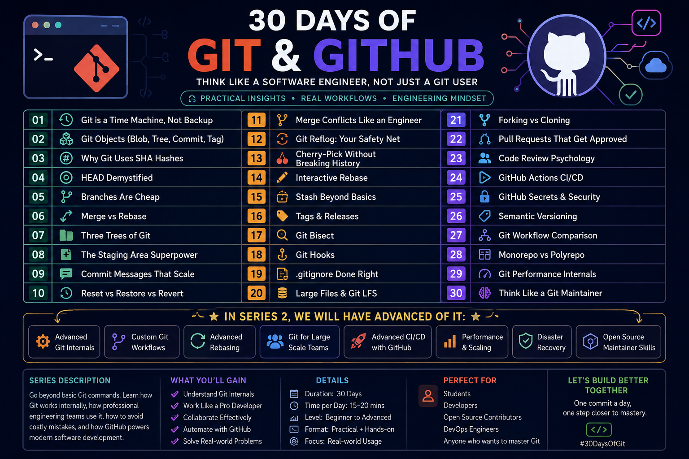

# 🚀 30 Days of Git & GitHub

> **Think Like a Software Engineer, Not Just a Git User**

Welcome to the **30 Days of Git & GitHub** series! 🎉

This repository is a practical, engineering-focused journey designed to help you master Git and GitHub—from the fundamentals to advanced workflows used by professional software engineers and open-source contributors.

Instead of simply learning commands, you'll understand **how Git works internally**, **why engineers use specific workflows**, and **how to collaborate effectively on real-world projects**.

---

# 🗺️ Roadmap

> This is the complete roadmap for the upcoming 30-day learning journey.

<p align="center">

</p>

---

# 📚 What This Series Covers

Throughout these 30 days, you'll learn:

* ✅ Git Fundamentals
* ✅ Git Internals
* ✅ Branching Strategies
* ✅ Merge & Rebase
* ✅ Git History Management
* ✅ GitHub Collaboration
* ✅ Pull Requests
* ✅ Code Reviews
* ✅ GitHub Actions (CI/CD)
* ✅ Security Best Practices
* ✅ Semantic Versioning
* ✅ Git Performance
* ✅ Open Source Workflows
* ✅ Real Engineering Practices

Every lesson is designed with practical examples, visual explanations, and real-world scenarios.

---

# 📅 Complete Learning Roadmap

| Day | Topic                                 |
| --- | ------------------------------------- |
| 01  | Git is a Time Machine, Not Backup     |
| 02  | Git Objects (Blob, Tree, Commit, Tag) |
| 03  | Why Git Uses SHA Hashes               |
| 04  | HEAD Demystified                      |
| 05  | Branches Are Cheap                    |
| 06  | Merge vs Rebase                       |
| 07  | Three Trees of Git                    |
| 08  | The Staging Area Superpower           |
| 09  | Commit Messages That Scale            |
| 10  | Reset vs Restore vs Revert            |
| 11  | Merge Conflicts Like an Engineer      |
| 12  | Git Reflog: Your Safety Net           |
| 13  | Cherry-Pick Without Breaking History  |
| 14  | Interactive Rebase                    |
| 15  | Stash Beyond Basics                   |
| 16  | Tags & Releases                       |
| 17  | Git Bisect                            |
| 18  | Git Hooks                             |
| 19  | .gitignore Done Right                 |
| 20  | Large Files & Git LFS                 |
| 21  | Forking vs Cloning                    |
| 22  | Pull Requests That Get Approved       |
| 23  | Code Review Psychology                |
| 24  | GitHub Actions CI/CD                  |
| 25  | GitHub Secrets & Security             |
| 26  | Semantic Versioning                   |
| 27  | Git Workflow Comparison               |
| 28  | Monorepo vs Polyrepo                  |
| 29  | Git Performance Internals             |
| 30  | Think Like a Git Maintainer           |

---

# 🎯 Who Should Join?

This series is perfect for:

* 👨‍🎓 Students
* 💻 Software Developers
* 🌐 Web Developers
* ⚙️ DevOps Engineers
* 🧪 QA Engineers
* 🚀 Open Source Contributors
* 🎯 Technical Interview Preparation
* ❤️ Anyone who wants to master Git & GitHub

---

# 📂 Repository Structure

```text
30-days-of-git-github/
│
├── README.md
├── image/
│   └── roadmap.png
│
├── Day-01-Git-Time-Machine/
├── Day-02-Git-Objects/
├── Day-03-Why-Git-Uses-SHA/
│
...
│
└── Day-30-Think-Like-a-Git-Maintainer/
```

---

# 💡 Learning Approach

Each day includes:

* 📖 Easy-to-understand explanation
* 🧠 Engineering mindset
* 💻 Practical Git commands
* 🛠 Real-world examples
* ⚠ Common mistakes
* 💡 Professional tips
* 🎯 Best practices
* 📝 Quick revision notes

The goal is not just to remember commands—but to understand **why** and **when** to use them.

---

# ⭐ Coming Next

📌 **Day 1: Git is a Time Machine, Not Backup**

You'll discover why Git is much more than a backup tool and how it enables developers to confidently experiment, recover changes, and manage project history.

Stay tuned—the journey starts soon!

---

# 🌟 Support the Series

If you find this repository helpful:

⭐ Star this repository

🍴 Fork it

📢 Share it with your friends

🤝 Follow along as a new lesson is added every day.

---

# 🚀 Series 2 (Coming Soon)

After completing this roadmap, we'll dive deeper into advanced topics, including:

* Advanced Git Internals
* Enterprise Git Workflows
* Advanced Rebasing
* Git at Scale
* Git Performance Optimization
* Advanced GitHub Actions
* Disaster Recovery
* Open Source Maintainer Skills

---

<div align="center">

## 🚀 One Day • One Concept • One Step Closer to Mastering Git

### Happy Learning!

</div>
